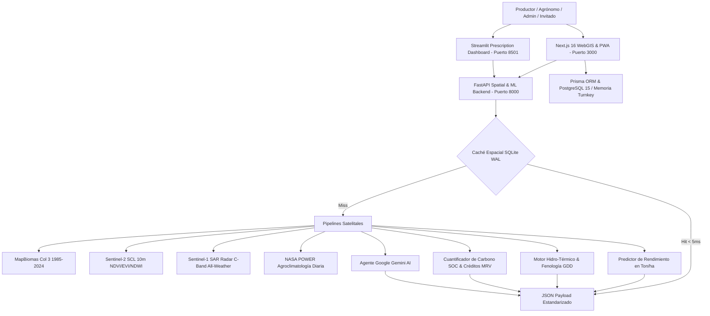

# Guía de Arquitectura, Desarrollo y Despliegue — Agrotech Venezuela 🛠️🌾

Bienvenido a la documentación técnica de ingeniería y despliegue de **Agrotech Venezuela**. Este documento concentra todos los requerimientos de entorno, diagramas de microservicios, instrucciones de ejecución local y comandos de auditoría para desarrolladores, evaluadores técnicos y operadores DevOps.

---

## 🏗️ 1. Arquitectura del Ecosistema de Microservicios

El sistema opera bajo una arquitectura distribuida y desacoplada compuesta por tres servicios principales interconectados con pipelines satelitales y cachés de baja latencia:



### Tabla de Puertos y Servicios

| Microservicio | Tecnología | Directorio | Puerto Local | Descripción |
| :--- | :--- | :--- | :---: | :--- |
| **Plataforma WebGIS** | Next.js 16 (Turbopack), React 19, Leaflet Nativo | `src/` | `3000` | Interfaz de usuario dual (Modo Productor / Modo Técnico), PWA offline, mapas y endpoints API. |
| **Backend Espacial & ML** | Python 3.13, FastAPI, Scikit-Learn | `backend/src/` | `8000` | Cálculo de idoneidad, modelos de cosecha, ingestión satelital y docs OpenAPI (`/docs`). |
| **Prescription Dashboard** | Streamlit 1.62, Folium, Plotly | `backend/` | `8501` | Dashboard analítico interactivo para prescripciones agronómicas avanzadas. |
| **Base de Datos** | PostgreSQL 15 (Docker) | `docker-compose.yml` | `5444` | Persistencia relacional de usuarios, parcelas y bitácora de labores de campo. |
| **Caché Geodésico** | SQLite 3 (Modo WAL) | `backend/src/` | *Embebido* | Respuestas espaciales cacheadas a 4 decimales (~11m de resolución) con latencias < 5ms. |

---

## 🚀 2. Ejecución Local Turnkey (Cero Fricción)

> [!TIP]
> **Modo Evaluación Inmediato (Zero-Config)**: Quien clone el repositorio **no necesita configurar credenciales ni levantar PostgreSQL** para probar la totalidad de la plataforma. El sistema detecta la ausencia de base de datos y activa automáticamente el proxy en memoria con suelos venezolanos, series satelitales simuladas y dictámenes agronómicos locales.

### Prerrequisitos de Entorno
- **Node.js**: 20.x o 22.x LTS (`node -v` y `npm -v`)
- **Python**: 3.13+ (Opcional, necesario solo si se desea correr FastAPI y Streamlit de forma nativa)
- **Docker & Docker Compose**: Opcional (recomendado para despliegues de producción y bases de datos aisladas)

---

### Paso 1: Iniciar Plataforma WebGIS (Next.js 16 Turbopack)

```bash
# 1. Clonar el repositorio
git clone https://github.com/frankSousa23/agrotech-venezuela.git
cd agrotech-venezuela

# 2. Instalar dependencias (Prisma Client se genera automáticamente en postinstall)
npm install

# 3. Iniciar servidor de desarrollo con Turbopack
npm run dev
```
Acceder de inmediato a **`http://localhost:3000`** en el navegador.

---

### Paso 2: Iniciar Backend Espacial & ML (FastAPI) — Opcional

```bash
cd backend

# En Windows:
py -m pip install -r requirements.txt
py -m uvicorn src.main:app --port 8000 --reload

# En Linux / macOS:
python3 -m pip install -r requirements.txt
python3 -m uvicorn src.main:app --port 8000 --reload
```
- API interactiva Swagger / OpenAPI disponible en: **`http://localhost:8000/docs`**
- Redoc disponible en: **`http://localhost:8000/redoc`**

---

### Paso 3: Iniciar Dashboard de Prescripción (Streamlit) — Opcional

```bash
cd backend

# En Windows:
py -m streamlit run streamlit_app.py --server.headless true

# En Linux / macOS:
python3 -m streamlit run streamlit_app.py --server.headless true
```
Acceder de inmediato a **`http://localhost:8501`**.

---

## 🐳 3. Despliegue con Docker Compose & Servidores Cloud / VPS

El archivo `docker-compose.yml` está configurado con aislamiento de perfiles (`profiles: ["prod", "production"]`) para permitir ejecutar la base de datos y microservicios en Docker sin interferir con el puerto local 3000:

```bash
# Desarrollo local con servicios de apoyo (inicia PostgreSQL en 5444, FastAPI en 8000 y Streamlit en 8501):
npm run services:up
npm run dev

# Detener los servicios de apoyo:
npm run services:down

# Despliegue completo de producción en un solo comando (Web, API, Streamlit y DB):
docker compose --profile prod up -d --build
```

### Configuración de Variables de Entorno
Consulte la plantilla documentada [`.env.production.example`](.env.production.example) para configurar llaves de Google Gemini API, tokens JWT y credenciales seguras de PostgreSQL en servidores VPS o Cloud:

```bash
cp .env.production.example .env.production
```

---

## 🧪 4. Suite Completa de Pruebas y Verificación (182 Tests)

El proyecto cuenta con una cobertura exhaustiva de pruebas unitarias, de integración, geoespaciales y de accesibilidad. Antes de realizar cualquier pull request o commit a `main`, se debe verificar la suite completa:

```bash
# 1. Pruebas Frontend Jest (130 tests: WebGIS, SAR Radar, GDD, Auth, UX Rural, IoT, Intentions):
npm test

# 2. Verificación Estática TypeScript (0 errores obligatorios):
npm run typecheck

# 3. Compilación de Producción Next.js 16 Turbopack (28 rutas limpias):
npm run build

# 4. Pruebas Backend Pytest (52 tests: FastAPI, ML Cosecha, GDD, Shoelace, Caché):
npm run test:backend

# 5. Suite Automatizada Unificada (182 de 182 tests aprobados):
npm run test:all
```

---

## 📐 5. Convenciones y Algoritmos Geoespaciales

1. **Cálculo de Área en Hectáreas**: Fórmula esferoidal de Shoelace geodésico proyectada sobre el elipsoide WGS84 (`src/lib/geo/spatialUtils.ts`).
2. **Cálculo de Distancias y Perímetro**: Fórmula de Haversine en kilómetros y metros.
3. **Detección Territorial**: Algoritmo Ray-Casting (Point-in-Polygon) sobre las geometrías de `src/lib/geo/venezuelaGeoJson.ts` antes de recurrir a proximidad euclidiana.
4. **Ciclo de Vida Leaflet Nativo**: Todos los mapas interactivos se inicializan con dynamic import (`ssr: false`), motor Leaflet puro (`L.map`) y ciclo de vida controlado por `useRef` para evitar memory leaks (prohibido el uso de `react-leaflet`).
5. **Máscara de Nubes Sentinel-2**: Uso estricto de la banda SCL (Scene Classification Layer) excluyendo sombras (3), nubes medias/altas (8, 9) y cirros (10).
6. **Grados Día (GDD)**: Base térmica $10.0^\circ\text{C}$ con techo $30.0^\circ\text{C}$ y balance hídrico $P - ET_c$ (`src/lib/geo/hydroThermalEngine.ts`).

---

## 📜 Licenciamiento
- Código fuente: **Licencia MIT** (Copyright © 2026 Frank Sousa - Agrotech Venezuela).
- Datos de cobertura vegetal: **MapBiomas Venezuela** bajo licencia **CC BY 4.0**.
