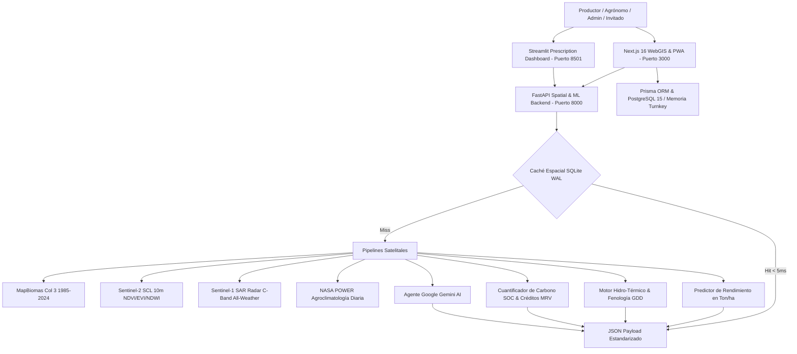

# Agrotech Venezuela 🌾🛰️

**Plataforma Integral de Inteligencia Edafo-Climática, Visión Satelital Multi-Escala (WebGIS 3 Niveles), Radar SAR Sentinel-1 Sin Nubes, Balance Hídrico & Grados Día (GDD), Cuantificación de Créditos de Carbono MRV, Machine Learning Agronómico, Accesibilidad Rural Dual-Mode UI y Asesoría Gemini AI.**

[](https://opensource.org/licenses/MIT)
[-black.svg)](https://nextjs.org/)
[](https://fastapi.tiangolo.com/)
[](https://streamlit.io/)
[](https://www.python.org/)
[](https://www.postgresql.org/)
[]()

Inspirada y potenciada con las clasificaciones de cobertura y uso del suelo (LULC) de **MapBiomas Venezuela** (1985–2024), **Sentinel-1 SAR Radar**, **Sentinel-2 L2A (Copernicus)** y **NASA POWER**, Agrotech transforma la observación satelital en **decisiones agronómicas precisas, prescriptivas y de acción directa** para productores, agrónomos e investigadores agrícolas.

---

## 🌟 Visión e Innovación Tecnológica

| Dimensión | MapBiomas Venezuela (Observacional) | Agrotech Venezuela (Prescriptivo y Acción) |
| :--- | :--- | :--- |
| **Jerarquía Cartográfica** | Nivel Macro-Nacional. | **WebGIS Multi-Escala de 3 Niveles**: Nacional (24 Estados) ➔ Municipal (335 Municipios / Polos Agrícolas) ➔ Micro-Parcela Sentinel-2 / Sentinel-1 SAR. |
| **Penetración de Nubes** | Obstruido en temporada lluviosa (óptico). | **Radar Sentinel-1 SAR (Banda C - 5.4 GHz)**: Retrodispersión $\gamma^\circ_{\text{VV}}/\gamma^\circ_{\text{VH}}$ para monitoreo de humedad de suelo y anegamiento 100% all-weather. |
| **Modelado Agroclimático** | Climatología general estática. | **Grados Día de Desarrollo ($GDD_{10}^{30}$) & Balance Hídrico ($P - ET_c$)**: Predicción fenológica de fechas de floración y madurez fisiológica. |
| **Certificación de Carbono** | No disponible. | **Calculadora de Créditos de Carbono & MRV**: Cuantificación de SOC (tC/ha), secuestro anual de $\text{tCO}_2\text{e}$ y valoración económica en USD (IPCC Tier 2 / Verra). |
| **Resiliencia Rural & PWA** | Dependencia 100% de internet estable. | **Indicador Visual de Conectividad & Sincronización**, caché geodésico SQLite WAL (< 5ms) y cola de mutaciones offline en IndexedDB. |
| **Accesibilidad Campesina** | Enfoque macroscópico sin adaptación rural. | **Dual-Mode UI**: *Modo Productor Fácil* con 4 Puertas táctiles, glosario coloquial (*Tierra Mansa / Brava*), dictado por voz y reaseguro de datos vs *Modo Técnico*. |
| **Modelado de Cosecha** | No disponible. | **Machine Learning Predictivo**: Estimación de rendimiento en **Ton/ha** para 8 cadenas productivas estratégicas. |
| **Prescripción Agronómica** | No prescriptivo. | **Calculadora de Encalado ($CaCO_3$) y Plan Nutricional $N-P-K$** adaptado a insumos venezolanos. |
| **Espacio del Productor** | No disponible. | **Mis Tierras & Cuaderno de Campo Digital**: Registro cronológico de labores, encalados, fertilizaciones y cosechas reales. |
| **Control de Acceso** | Acceso público general. | **Modo Invitado (1-Click Sandbox Multi-Sesión)**, Registro con aprobación administrativa y **Panel de Control (`/dashboard/admin`)**. |
| **Inteligencia Artificial** | No disponible. | **Agente Google Gemini AI**: Diagnósticos técnicos estructurados y chat agronómico contextual de 40 años. |
| **Expediente de Premiación** | No disponible. | **Centro Oficial de Postulación MapBiomas 2026 (`/dashboard/postulacion`)**: TRL 7, 5 PDFs oficiales (Bases, Guía, FAQs, Formulario y Paper Científico). |

---

## 🏗️ Arquitectura del Ecosistema



---

## 🗺️ Módulos Principales del Sistema

### 1. Visor WebGIS Multi-Escala & Radar SAR (`/dashboard/mapa`)
- **Nivel 1 (Nacional)**: Los 24 estados georreferenciados con selector de capas en vivo (**MapBiomas 2024 LULC**, **Semáforo de pH del Suelo**, **Lluvia NASA POWER**, **Radar SAR Sentinel-1**, **Satélite Esri HD**), leyendas dinámicas flotantes y sincronización de redimensionamiento (`map.invalidateSize()`).
- **Nivel 2 (Municipal)**: Transición fluida a polos productivos agrícolas (Turén, Santa Rosalía, Calabozo, Colón, Pedraza, Quíbor, etc.) con polígonos vectoriales GeoJSON, centros de acopio y pH promedio.
- **Nivel 3 (Micro-Parcela)**: Imagen satelital con herramienta vectorial interactiva de delimitación y cálculo esferoidal de hectáreas (**Shoelace geodésico proyectado sobre WGS84**).

### 2. Balance Hídrico & Grados Día de Crecimiento ($GDD_{10}^{30}$)
- Cálculo diario de acumulación térmica ajustado a cultivos tropicales (Maíz, Arroz, Caña de Azúcar, Café, Cacao).
- Predicción cronológica de estadios fenológicos: Emergencia ($V_E$), Diferenciación ($V_6-V_8$), Floración/Antesis ($R_1$), Llenado de Grano ($R_3-R_4$) y Madurez Fisiológica/Cosecha ($R_6$).
- Curva mensual de balance hídrico (Precipitación efectiva vs Evapotranspiración $ET_c$).

### 3. Calculadora de Créditos de Carbono & MRV
- Cuantificación de Stock de Carbono Orgánico en Suelo ($SOC = \text{OM\%} \times 0.58 \times \rho_b \times \text{profundidad}$).
- Evaluación de secuestro anual ($\text{tCO}_2\text{e}/\text{ha}/\text{año}$) bajo Siembra Directa + Coberturas vs Sistemas Agroforestales vs Labranza Convencional.
- Estimación económica en USD de bonos de carbono para el productor agrícola (Metodología IPCC Tier 2 / Verra VCS).

### 4. Indicador de Conectividad & Sincronización en Tiempo Real
- Píldora persistente en cabecera con monitoreo de red (`En Línea 🟢`, `Modo Finca Offline 🟠`, `Sincronizando 🔄`).
- Contador de registros agronómicos pendientes en IndexedDB y botón de sincronización forzada al recuperar señal en campo.

### 5. Espacio del Productor: "Mis Tierras" y "Cuaderno de Campo Digital"
- **Mis Tierras (`/dashboard/tierras`)**: Gestión de parcelas delimitadas, cultivo actual, textura edafológica y acceso a diagnósticos con Gemini AI.
- **Cuaderno de Campo (`/dashboard/bitacora`)**: Registro cronológico de labores (Siembra, Encalado dolomítico, Fertilización NPK/Urea, Riego, Cosecha) y comparación de rendimientos reales (**Ton/ha**).

### 6. Simulador Edafológico & Asesor Gemini AI (`/dashboard/recomendaciones`)
- Sliders reactivos de pH, Materia Orgánica y Textura del Suelo.
- Generación de dictamen agronómico con Gemini AI y exportación de Gemelo Digital en GeoJSON.

### 7. Omnibox (Command Palette) & Navegación Global
- Búsqueda interactiva (Ctrl+K) de estados, municipios y herramientas del sistema.
- Redirección automática y enfoque profundo en el WebGIS usando parámetros de URL (`?state=Zulia`).

### 8. Sistema de Temas & Modo Pleno Sol
- Modos Claro, Oscuro y **Pleno Sol (Alto Contraste)** diseñados para operaciones de campo bajo alta luminosidad, cumpliendo con estándares WCAG AAA.

### 9. Modo Demostración / Tour Guiado de 5 Pasos (`DemoTourModal`)
- Acceso directo mediante el botón **`🎬 Tour Demo`** en la cabecera superior y barra móvil del Dashboard.
- Recorrido interactivo guiado para comités técnicos, jurados y evaluadores que sintetiza los 5 pilares:
  1. *Cartografía Nacional & Edafología MapBiomas*.
  2. *Micro-Parcelas & Radar SAR Sentinel-1 Banda C All-Weather*.
  3. *Prescripción con Gemini AI & Suelos*.
  4. *Laboratorio Agro-IoT de Micro-Cultivo & Riego Predictivo*.
  5. *Madurez TRL 7, MRV de Carbono & APIs OpenAPI*.

### 10. Navegación Universal de Retorno & Ergonomía de Roles
- Componente inteligente `BackButton` a prueba de fallos integrado en vistas standalone (`/api-docs`, `/auth/login`, `/auth/register`, `/dashboard/postulacion`, `/dashboard/arquitectura`) y en la barra móvil.
- Retorno multinivel en el WebGIS (`← Volver a [Estado]` y `← Volver a Venezuela`).
- Selector ágil de roles (1-Click Switcher: `FARMER`, `AGRONOMIST`, `ADMIN`, `GUEST`) para auditoría de permisos.

### 11. Integración E2E Parcela ➔ Prescripción IA Directa
- Botón **`✨ Prescripción IA`** en cada tarjeta de lote en `/dashboard/tierras`.
- Transferencia fluida de parámetros geodésicos (`stateId`, `crop`, `parcelName`) hacia `/dashboard/recomendaciones`, activando la insignia de vinculación de parcela e inicializando el motor agronómico sin recaptura manual.

### 12. Laboratorio Agro-IoT de Micro-Cultivo & Riego Predictivo In-Situ
- Entorno didáctico interactivo (`/dashboard/iot`) para experimentar con sensores edáficos en bancales y mesas de cultivo antes de su despliegue a escala de lote.
- Corte transversal vivo en SVG con animación de micro-goteo, dinámica radicular e hidratación del suelo según % VWC.
- 3 Presets agronómicos (Tomate Cherry/Hortalizas, Maíz Dulce, Vivero Café/Cacao).
- Algoritmo de supresión inteligente de riego ante alertas de lluvia de NASA POWER, cuantificando ahorro hídrico (L) y energético (kWh) en tiempo real.
- Guía de hardware completa (ESP32 DevKit v1, relé 5V, electroválvula 12V y sensor capacitivo v1.2 por < $35 USD) con código Arduino C++ listo para flashear y calculadora de calibración ADC.

### 13. Experiencia Productor Sin Barreras (Dual-Mode UI)
- Selector de modo accesible en cabecera (`Modo Productor Fácil` vs `Modo Técnico`).
- Panel de 4 Puertas Campesinas en el inicio con botones de alto contraste, tipografía agrandada y reaseguro de persistencia (*"Tranquilo, tu finca está guardada en este teléfono"*).
- Glosario edafológico y técnico coloquial adaptado a la terminología rural venezolana (*Tierra Mansa* vs *Tierra Brava*, *Ojos Satelitales SAR*, *Medida Shoelace*).

### 14. Navegador de Intenciones Agrícolas & Dictado por Voz Nativo
- Modal interactivo con 6 tarjetas de acción directa: *1. Saber cómo está mi tierra*, *2. Ver si va a llover o secar*, *3. Medir mi parcela*, *4. Elegir qué sembrar*, *5. Anotar lo que hice hoy*, *6. Hablar con el asistente*.
- Asistente de voz nativo en el navegador mediante **Web Speech API** (`es-VE`) para dictar consultas y escuchar recomendaciones agronómicas sin necesidad de teclado.

### 15. Centro Oficial de Postulación & Expediente Científico MapBiomas 2026 (`/dashboard/postulacion`)
- Dossier institucional con madurez tecnológica **TRL 7 (Sistema Validado en Entorno Real)**.
- Descarga directa en **PDF y Markdown** de los 5 documentos oficiales del premio:
  - *Bases Oficiales del Premio (10 págs.)*
  - *Preguntas Frecuentes del Jurado (6 págs.)*
  - *Guía de Postulación Oficial*
  - *Formulario de Postulación Oficial*
  - *Artículo Científico y Manuscrito Técnico: Validación TRL 7, Shoelace WGS84, Radar SAR y Hoja de Ruta 2026–2030*
- Matriz de cumplimiento cruzada frente a los 6 criterios de evaluación del jurado (Complejidad 20%, Originalidad 20%, Claridad 15%, Resultados 20%, Aporte General 20% y MapBiomas 5%).

### 16. Modo Invitado Sandbox Multi-Sesión Aislado (1-Click Guest)
- Acceso instantáneo sin formularios ni contraseñas para jurados, docentes y evaluadores.
- Aislamiento completo de parcelas y cuaderno de campo por sesión efímera, permitiendo que múltiples usuarios prueben la plataforma simultáneamente sin sobreescribir datos ajenos.

---

## 🚀 Despliegue y Ejecución Local Turnkey (Cero Fricción)

> [!TIP]
> **Modo Evaluación Inmediato**: Quien clone el repositorio **no necesita configurar credenciales ni levantar PostgreSQL** para probar la totalidad de la plataforma. El sistema detecta la ausencia de base de datos y activa automáticamente el proxy en memoria con suelos venezolanos, series satelitales simuladas y dictámenes agronómicos expertos locales.

### Prerrequisitos
- Node.js 20+ o 22+
- Python 3.13+ (Opcional para FastAPI y Streamlit)
- PostgreSQL 15 o Docker (Opcional)

### 1. Iniciar Plataforma WebGIS (Next.js 16)
```bash
# Clonar el repositorio
git clone https://github.com/frankSousa23/agrotech-venezuela.git
cd agrotech-venezuela

# Instalar dependencias (Prisma Client se genera automáticamente en postinstall)
npm install

# Iniciar servidor de desarrollo con Turbopack
npm run dev
# Acceder de inmediato a http://localhost:3000
```

### 2. Iniciar Backend Espacial & ML (FastAPI) — Opcional
```bash
cd backend
py -m pip install -r requirements.txt
py -m uvicorn src.main:app --port 8000 --reload
# Documentación interactiva en http://localhost:8000/docs
```

### 3. Iniciar Dashboard de Prescripción (Streamlit) — Opcional
```bash
cd backend
py -m streamlit run streamlit_app.py --server.headless true
# Acceder a http://localhost:8501
```

### 4. Despliegue Productivo con Docker & Servidores Cloud / VPS
El servicio web en `docker-compose.yml` está configurado con aislamiento de perfiles (`profiles: ["prod", "production"]`) para permitir ejecutar la base de datos y microservicios en Docker sin interferir con el puerto local 3000:

```bash
# Desarrollo local (inicia BD 5444, API 8000 y Streamlit 8501 en Docker; Web local con Turbopack)
npm run services:up
npm run dev

# Despliegue de producción completo en un solo comando
docker compose --profile prod up -d --build
```

Consulte la plantilla documentada [`.env.production.example`](.env.production.example) para configurar llaves de Google Gemini API, tokens JWT y credenciales seguras de PostgreSQL en servidores VPS o Cloud.

---

## 🧪 Validación y Pruebas Automatizadas (179 Tests)

Antes de cualquier commit a la rama `main`, se ejecutan y validan ambas suites de testing:

```bash
# 1. Pruebas Frontend: WebGIS, SAR Radar, GDD, Auth, Diary, Spatial, Routing, Search, IoT & Farmer UX (Jest — 128 tests)
npm test

# 2. Verificación Estática TypeScript (0 errores obligatorios)
npm run typecheck

# 3. Compilación de Producción (Next.js 16 Turbopack — 28 rutas limpias)
npm run build

# 4. Pruebas Backend Espacial, ML, IA y Carga (Pytest — 51 tests)
npm run test:backend

# 5. Suite Unificada Automatizada Completa (179 tests)
npm run test:all
```

---

## 📜 Licenciamiento y Atribución

- **Código Fuente**: Licencia **MIT** (Copyright © 2026 Frank Sousa - Agrotech Venezuela).
- **Datos de Cobertura y Uso del Suelo**: Referencian y construyen sobre la iniciativa **MapBiomas Venezuela** (Provita, LSIGMA USB, Wataniba y RAISG), disponible bajo licencia **Creative Commons Atribución 4.0 Internacional (CC BY 4.0)**.

**Uso de MapBiomas en el Proyecto:** 
Agrotech Venezuela integra los datos de cobertura vegetal de MapBiomas para comprender la evolución histórica del suelo (1985-2024). Esta información se procesa junto con datos climáticos (NASA POWER), radar SAR (Sentinel-1) y modelos de IA para generar **prescripciones agronómicas de alta precisión**. El objetivo de esta integración es ayudar al productor a elegir el cultivo adecuado, evaluar el secuestro de carbono y aplicar prácticas regenerativas, con el fin último de **mejorar la productividad de las siembras y garantizar la sostenibilidad agrícola**.
