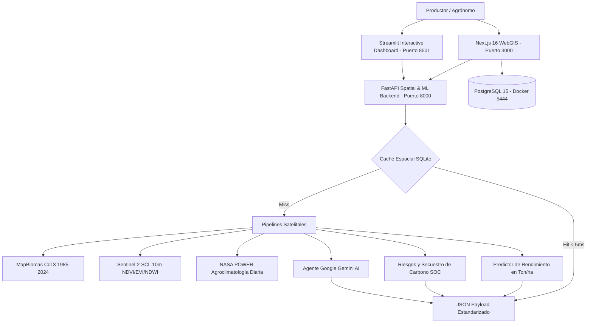

# Agrotech Venezuela 🌾🛰️

**Plataforma Integral de Inteligencia Edafo-Climática, Visión Satelital (WebGIS), Machine Learning Agronómico y Prescripción Asistida por IA.**

[](https://opensource.org/licenses/MIT)
[-black.svg)](https://nextjs.org/)
[](https://fastapi.tiangolo.com/)
[](https://streamlit.io/)
[](https://www.python.org/)
[](https://www.postgresql.org/)
[]()

Inspirada y potenciada con las clasificaciones de cobertura y uso del suelo (LULC) de **MapBiomas Venezuela** (1985–2024), **Sentinel-2 L2A (Copernicus)** y **NASA POWER**, Agrotech transforma la observación satelital en **decisiones agronómicas precisas, prescriptivas y de acción directa** para agrónomos, productores e investigadores agrícolas.

---

## 🌟 Visión e Innovación Tecnológica (Nivel Competición)

| Dimensión | MapBiomas Venezuela (Observacional) | Agrotech Venezuela (Prescriptivo y Acción) |
| :--- | :--- | :--- |
| **Ingreso de Datos** | Consulta manual en visor o descarga de rasters. | **Automático por Coordenadas GPS $(Lat, Lon)$**: Ingesta satelital de 40 años sin fricción. |
| **Resolución Espacial** | 30 metros (Landsat). | **10 metros a nivel de parcela** (Sentinel-2 L2A con máscara de nubes SCL). |
| **Clima en Tiempo Real** | Climatología general. | **NASA POWER Diario**: Temperatura, radiación solar y Grados Día de Desarrollo (**GDD**). |
| **Modelado de Cosecha** | No disponible. | **Machine Learning Predictivo**: Estimación de rendimiento en **Ton/ha** para 8 cultivos estratégicos. |
| **Prescripción Agronómica** | No prescriptivo. | **Calculadora de Encalado ($CaCO_3$) y Plan Nutricional $N-P-K$** adaptado a insumos venezolanos. |
| **Inteligencia Artificial** | No disponible. | **Agente Google Gemini AI**: Diagnósticos técnicos estructurados y chat agronómico. |
| **Resiliencia Rural** | Dependencia 100% de internet estable. | **Base de Datos SQLite en Caché Local (< 5ms)** y compatibilidad PWA Offline. |

---

## 🏗️ Arquitectura del Ecosistema



---

## 🗺️ Módulos Principales del Sistema

1. **Visor WebGIS Multidimensional (`/dashboard/mapa`)**:
   - 4 Mapas base de alta resolución (Satélite Esri HD, Dark Matter, OpenTopoMap, OSM).
   - Capas temáticas superponibles (MapBiomas LULC, Semáforo de pH del Suelo, Fertilidad Edafológica y Lluvia).
   - Control de opacidad dinámico, Geo-Inspector lateral y marcadores GPS trazables.

2. **Delimitador de Fincas y Gemelo Digital (`ParcelDiagnosticModal`)**:
   - Herramienta vectorial interactiva para delimitar parcelas sobre el mapa satelital.
   - Cálculo geodésico exacto de hectáreas (Shoelace) y perímetro (Haversine).
   - Exportación descargable en formato **GeoJSON** estándar.

3. **Dashboard Interactivo de Prescripción (Streamlit en `:8501`)**:
   - Selector de zonas agrícolas clave (Turén, Sur del Lago, Calabozo, Chuao, Bailadores, Maturín).
   - Sliders reactivos de pH, Materia Orgánica, Textura y Hectáreas.
   - Gráfico cronológico de 40 años de transición de coberturas (1985–2024) y semáforo de riesgos.
   - Dictamen técnico agronómico descargable en Markdown y GeoJSON.

4. **Motor Predictivo de Machine Learning y Carbono**:
   - Curvas de respuesta agroecológica calibradas para Venezuela (CENIAP/INIA/Danac/Fundación Polar).
   - Proyecciones de rendimiento en Ton/ha para: *Maíz Blanco, Arroz de Riego, Plátano, Cacao Criollo, Café Arábica, Caña de Azúcar, Soya y Pasturas Tropicales*.
   - Cuantificación de riesgos (Sequía, Encharcamiento, Acidez, Calor) y balance de captura de Carbono Orgánico del Suelo (**SOC / $CO_2$ eq**).

5. **Agente Asesor con Google Gemini AI**:
   - Dictámenes técnicos estructurados con recomendaciones de enmiendas (Cal Dolomítica) y nutrición balanceada (NPK 12-24-12, Urea, Roca Fosfórica de Riecito).
   - Chat interactivo agronómico en tiempo real.

---

## 🚀 Guía de Inicio Rápido

### Opción 1: Despliegue con Docker Compose (Recomendado)
```bash
# 1. Clonar el repositorio
git clone https://github.com/frankSousa23/agrotech-venezuela.git
cd agrotech-venezuela

# 2. Levantar todos los microservicios en Docker
docker-compose up -d --build
```
- **Plataforma WebGIS Principal**: [http://localhost:3000](http://localhost:3000)
- **Dashboard Streamlit Interactivo**: [http://localhost:8501](http://localhost:8501)
- **Documentación Swagger FastAPI**: [http://localhost:8000/docs](http://localhost:8000/docs)
- **Swagger UI Next.js**: [http://localhost:3000/api-docs](http://localhost:3000/api-docs)

---

### Opción 2: Ejecución Local en Desarrollo

#### 1. Iniciar Base de Datos PostgreSQL
```bash
docker-compose up -d agrotech-db
```

#### 2. Backend de Ingesta Espacial, ML y Gemini AI (Python)
```bash
cd backend
py -m pip install -r requirements.txt
py -m pip install scikit-learn google-genai streamlit folium streamlit-folium plotly

# Iniciar API FastAPI en puerto 8000
py -m uvicorn src.main:app --host 0.0.0.0 --port 8000 --reload

# Iniciar Dashboard Streamlit en puerto 8501 (en otra terminal)
py -m streamlit run streamlit_app.py
```

#### 3. Frontend WebGIS (Next.js 16)
```bash
cd agrotech-app
npm install
npx prisma generate
npx prisma db push
npx prisma db seed
npm run dev
```

---

## 🧪 Suite Integral de Pruebas Automatizadas (63 Tests)

El proyecto cuenta con cobertura de pruebas automatizadas en ambas capas:

```bash
# 1. Tests de Backend Espacial, ML, Gemini, Folium y Carga (33 tests)
cd backend
py -m pytest tests

# 2. Tests de Frontend WebGIS, Cálculos Geodésicos y APIs (30 tests)
cd agrotech-app
npm test
```

**Resultado de Pruebas**: **63 / 63 pruebas aprobadas al 100%**.

---

## 📡 Catálogo de APIs REST (OpenAPI 3.0)

| Endpoint | Método | Descripción |
| :--- | :--- | :--- |
| `/api/geo` | `GET / POST` | Capas GeoJSON de Venezuela, puntos GPS, metadatos y perfil espacial unificado. |
| `/api/v1/spatial/profile` | `POST` | Ingesta de $(Lat, Lon)$, MapBiomas Col 3, Sentinel-2 SCL 10m y NASA POWER con caché SQLite. |
| `/api/v1/predict/crops` | `POST` | Predicción ML de aptitud y rendimiento (Ton/ha) para 8 cultivos. |
| `/api/v1/predict/risks` | `POST` | Cuantificación de riesgos agroclimáticos y captura de carbono ($CO_2$ eq/ha). |
| `/api/v1/ai/prescribe` | `POST` | Generación de prescripción agronómica integral con Google Gemini AI. |
| `/api/v1/ai/consult` | `POST` | Consulta conversacional interactiva con el agente agrónomo. |
| `/api/crops` | `GET / POST` | Catálogo de cultivos y tolerancias de pH. |
| `/api/soils` | `GET / POST` | Registro y consulta de perfiles edafológicos. |
| `/api/recomendaciones` | `GET` | Matriz de compatibilidad y dosis de encalado. |
| `/api/export/stats` | `GET` | Exportación consolidada en formato CSV y Excel XLSX. |

---

## 📄 Licencia, Términos Open Source y Atribución

### Licencia de Software (Código Abierto)
Este proyecto está publicado bajo los términos de la **Licencia MIT**:
- **Uso libre y gratuito**: Cualquier persona u organización puede usar, estudiar, modificar, integrar y distribuir este software de forma gratuita tanto para fines académicos como comerciales.
- **Condición de atribución**: Se requiere mantener el aviso de copyright original y otorgar el debido crédito al creador del proyecto (**Frank Sousa - Agrotech Venezuela**).

### Atribución y Reconocimiento a MapBiomas Venezuela
Las clasificaciones temáticas de cobertura y uso del suelo (LULC) integradas como referencia en esta plataforma están fundamentadas en los datos abiertos de la iniciativa **MapBiomas Venezuela**, publicados bajo la licencia internacional **Creative Commons Atribución 4.0 (CC BY 4.0)**:
- **Referencia Oficial**: *Colección de Cobertura y Uso del Suelo de Venezuela*, desarrollada por **Provita**, el **Laboratorio LSIGMA de la Universidad Simón Bolívar (USB)**, **Wataniba** y la **Red Amazónica de Información Socioambiental Georreferenciada (RAISG)**.
- **Portales de Acceso**: [venezuela.mapbiomas.org](https://venezuela.mapbiomas.org) | [plataforma.venezuela.mapbiomas.org](https://plataforma.venezuela.mapbiomas.org)

---

*Desarrollado con fines de innovación científica y tecnológica por Frank Sousa (2026).*
