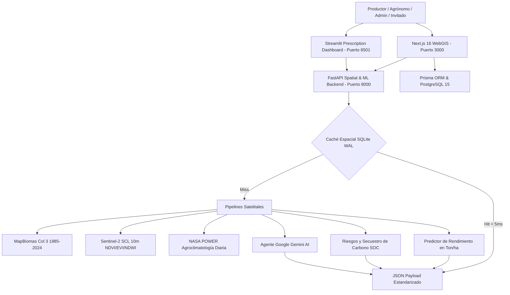

# Agrotech Venezuela 🌾🛰️

**Plataforma Integral de Inteligencia Edafo-Climática, Visión Satelital Multi-Escala (WebGIS 3 Niveles), Machine Learning Agronómico, Asesoría Asistida por Gemini AI y Cuaderno de Campo Digital.**

[](https://opensource.org/licenses/MIT)
[-black.svg)](https://nextjs.org/)
[](https://fastapi.tiangolo.com/)
[](https://streamlit.io/)
[](https://www.python.org/)
[](https://www.postgresql.org/)
[]()

Inspirada y potenciada con las clasificaciones de cobertura y uso del suelo (LULC) de **MapBiomas Venezuela** (1985–2024), **Sentinel-2 L2A (Copernicus)** y **NASA POWER**, Agrotech transforma la observación satelital en **decisiones agronómicas precisas, prescriptivas y de acción directa** para productores, agrónomos e investigadores agrícolas.

---

## 🌟 Visión e Innovación Tecnológica

| Dimensión | MapBiomas Venezuela (Observacional) | Agrotech Venezuela (Prescriptivo y Acción) |
| :--- | :--- | :--- |
| **Jerarquía Cartográfica** | Nivel Macro-Nacional. | **WebGIS Multi-Escala de 3 Niveles**: Nacional (24 Estados) ➔ Municipal (Polos Agrícolas) ➔ Micro-Parcela Sentinel-2 con Leaflet nativo. |
| **Ingreso de Datos** | Consulta manual en visor o rasters. | **Automático por GPS $(Lat, Lon)$**: Ingesta satelital de 40 años sin fricción y trazado interactivo de polígonos. |
| **Resolución Espacial** | 30 metros (Landsat). | **10 metros a nivel de parcela** (Sentinel-2 L2A con máscara de nubes SCL). |
| **Clima en Tiempo Real** | Climatología general. | **NASA POWER Diario**: Temperatura, radiación solar, precipitación y Grados Día de Desarrollo (**GDD**). |
| **Modelado de Cosecha** | No disponible. | **Machine Learning Predictivo**: Estimación de rendimiento en **Ton/ha** para 8 cadenas productivas estratégicas. |
| **Prescripción Agronómica** | No prescriptivo. | **Calculadora de Encalado ($CaCO_3$) y Plan Nutricional $N-P-K$** adaptado a insumos venezolanos. |
| **Espacio del Productor** | No disponible. | **Mis Tierras & Cuaderno de Campo Digital**: Registro cronológico de labores, encalados y cosechas reales. |
| **Control de Acceso** | Acceso público general. | **Modo Invitado (1-Click Sandbox)**, Registro con estado `PENDING` y **Panel de Administración (`/dashboard/admin`)**. |
| **Inteligencia Artificial** | No disponible. | **Agente Google Gemini AI**: Diagnósticos técnicos estructurados y chat agronómico contextual. |
| **Resiliencia Rural** | Dependencia 100% de internet estable. | **Base de Datos SQLite en Caché Local (< 5ms)** con hashing geodésico a 4 decimales (~11m). |
| **Estudio Arquitectónico** | Diagramas estáticos. | **Dataflow Diagram Studio (`/dashboard/arquitectura`)**: Renderizado interactivo con Mermaid y D3.js. |

---

## 🏗️ Arquitectura del Ecosistema



---

## 🗺️ Módulos Principales del Sistema

### 1. Visor WebGIS Multi-Escala de 3 Niveles (`/dashboard/mapa`)
- **Nivel 1 (Nacional)**: Los 24 estados georreferenciados con selector de capas en vivo (**MapBiomas 2024 LULC**, **Semáforo de pH del Suelo**, **Lluvia NASA POWER**, **Satélite Esri HD**).
- **Nivel 2 (Municipal)**: Transición fluida a polos productivos agrícolas (Turén, Santa Rosalía, Calabozo, Colón, Pedraza, Quíbor, etc.) con polígonos vectoriales GeoJSON, centros de acopio y pH promedio.
- **Nivel 3 (Micro-Parcela)**: Imagen satelital de alta resolución con herramienta vectorial de delimitación y cálculo esferoidal de hectáreas (**Shoelace geodésico proyectado sobre WGS84**).

### 2. Estudio de Diagramas de Arquitectura (`/dashboard/arquitectura`)
- Visualizador interactivo de arquitectura técnica con motores de renderizado **Mermaid.js** y **D3.js**.
- Diagramas de flujo de datos, ciclo de vida de autenticación sandbox, árbol jerárquico WebGIS y pipeline geoespacial satelital.

### 3. Autenticación & Perfiles de Acceso (`/auth/login` y `/auth/register`)
- **Modo Invitado (1-Click Demo Sandbox)**: Acceso instantáneo con parcelas y datos de muestra sin registro.
- **Flujo de Aprobación Administrativa**: Nuevos registros quedan en estado **`PENDING`** hasta ser validados.
- **Perfiles Soportados**: `FARMER` (Productor Agrícola), `AGRONOMIST` (Ingeniero Agrónomo), `ADMIN` (Administrador).

### 4. Panel de Administración (`/dashboard/admin`)
- Bandeja de solicitudes pendientes con botones de acción rápida en 1-click (**Aprobar ✓** / **Rechazar ✕**).
- Directorio de usuarios y telemetría general de la plataforma.

### 5. Espacio del Productor: "Mis Tierras" y "Cuaderno de Campo Digital"
- **Mis Tierras (`/dashboard/tierras`)**: Gestión de parcelas delimitadas, cultivo actual, textura edafológica y acceso a diagnósticos con Gemini AI.
- **Cuaderno de Campo (`/dashboard/bitacora`)**: Registro cronológico de labores (Siembra, Encalado dolomítico, Fertilización NPK/Urea, Riego, Cosecha) y comparación de rendimientos reales (**Ton/ha**).

### 6. Simulador Edafológico & Asesor Gemini AI (`/dashboard/recomendaciones`)
- Sliders reactivos de pH, Materia Orgánica y Textura del Suelo.
- Generación de dictamen agronómico con Gemini AI y exportación de Gemelo Digital en GeoJSON.

### 7. Documentación OpenAPI / Swagger 3.0 (`/api-docs` y `/docs`)
- Catálogo REST interactivo que documenta los endpoints de WebGIS, Autenticación, Administración, Parcelas, Bitácora, Edafología y Gemini AI.

---

## 🚀 Despliegue y Ejecución Local

### Prerrequisitos
- Node.js 20+ o 22+
- Python 3.13+
- PostgreSQL 15 (o Docker)

### 1. Iniciar Plataforma WebGIS (Next.js 16)
```bash
# Instalar dependencias y generar cliente Prisma
npm install
npx prisma generate

# Iniciar servidor de desarrollo con Turbopack
npm run dev
# Acceder a http://localhost:3000
```

### 2. Iniciar Backend Espacial & ML (FastAPI)
```bash
cd backend
py -m pip install -r requirements.txt
py -m uvicorn src.main:app --port 8000 --reload
# Documentación interactiva en http://localhost:8000/docs
```

### 3. Iniciar Dashboard de Prescripción (Streamlit)
```bash
cd backend
py -m streamlit run streamlit_app.py
# Acceder a http://localhost:8501
```

---

## 🧪 Validación y Pruebas Automatizadas (79 Tests)

Antes de cualquier commit a la rama `main`, se ejecutan y validan ambas suites de testing:

```bash
# 1. Pruebas Unitarias Frontend, WebGIS, Auth & APIs (Jest - 40 tests)
npm test

# 2. Compilación de Producción (Next.js 16 Turbopack - 24 rutas)
npm run build

# 3. Pruebas Backend Espacial, ML, GEE y Caché (Pytest - 39 tests)
cd backend && py -m pytest tests
```

---

## 📜 Licenciamiento y Atribución

- **Código Fuente**: Licencia **MIT** (Copyright © 2026 Frank Sousa - Agrotech Venezuela).
- **Datos de Cobertura y Uso del Suelo**: Referencian y construyen sobre la iniciativa **MapBiomas Venezuela** (Provita, LSIGMA USB, Wataniba y RAISG), disponible bajo licencia **Creative Commons Atribución 4.0 Internacional (CC BY 4.0)**.
