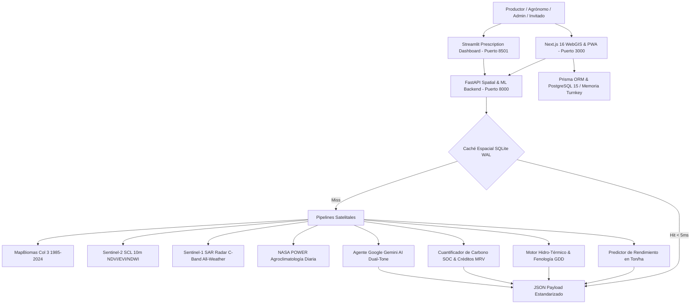

# Agrotech Venezuela 🌾🛰️

**Plataforma Integral de Inteligencia Edafo-Climática, Visión Satelital Multi-Escala, Radar SAR Sentinel-1 Sin Nubes, Balance Hídrico & Grados Día (GDD), Cuantificación de Créditos de Carbono MRV, Machine Learning Agronómico, Accesibilidad Rural Dual-Mode UI y Asesoría Gemini AI.**

[](https://opensource.org/licenses/MIT)
[-black.svg)](https://nextjs.org/)
[](https://fastapi.tiangolo.com/)
[](https://streamlit.io/)
[](https://www.python.org/)
[](https://www.postgresql.org/)
[]()
[-orange.svg)]()

Inspirada y potenciada con las clasificaciones de cobertura y uso del suelo (LULC) de **MapBiomas Venezuela** (1985–2024), **Sentinel-1 SAR Radar**, **Sentinel-2 L2A (Copernicus)** y **NASA POWER**, Agrotech transforma la teledetección espacial en **decisiones agronómicas prescriptivas y de acción directa** para productores, extensionistas agrícolas e investigadores.

---

## 🧭 Navegación Rápida Basada en Perfiles (Role-Based Navigation)
> *Selecciona tu perfil de interés para acceder directamente a la información adaptada a tus prioridades:*

| Perfil de Audiencia | Enfoque Estratégico | Acceso Directo |
| :--- | :--- | :--- |
| 🛠️ **Para Desarrolladores & DevOps** | Arquitectura de microservicios, stack tecnológico, despliegue turnkey en 2 min, Docker y suite de pruebas (**202 tests**). | [Ir a Guía de Desarrollo & Despliegue ➔](#-para-desarrolladores--devops) |
| 🏆 **Para Jurados de Innovación e Inversores** | Nivel de madurez operacional **TRL 7**, impacto socioeconómico (**ROI 3.8x**, -35% fertilizantes), agregación **Carbon Pooling (85/15)** y ODS. | [Ir a Expediente TRL 7 & Modelo de Negocio ➔](#-para-jurados-de-innovación-e-inversores) |
| 🌾 **Para Agrónomos y Productores** | Modo Productor Fácil (**4 Puertas**), resiliencia PWA offline en 2G/EDGE, dictado por voz y prescripciones VRA para maquinaria. | [Ir a Operaciones de Campo & Accesibilidad ➔](#-para-agrónomos-extensionistas-y-productores) |

---

## 🔄 Flujo Conceptual del Pipeline de Datos

```
 ┌──────────────────────────┐      ┌──────────────────────────┐      ┌──────────────────────────┐
 │  OBSERVACIÓN ESPACIAL    │      │   CEREBRO AGRONÓMICO     │      │   ACCIÓN EN CAMPO &      │
 │  & SENSORES DE TIERRA    │      │   & GEMINI IA DUAL-TONE  │      │   RETORNO FINANCIERO     │
 └─────────────┬────────────┘      └─────────────┬────────────┘      └─────────────┬────────────┘
               │                                 │                                 │
   • Radar SAR Sentinel-1 Banda C    • Asesor Gemini 2.5 Flash         • Prescripciones VRA Maquinaria
     (Penetra nubes tropicales)        ("El Compadre Agrónomo")          (ESRI Shapefile / KML / Papel)
   • Sentinel-2 L2A (10m NDVI/EVI)   • Motor Hidro-Térmico GDD         • Encalado & N-P-K Geo-calibrado
   • Clima NASA POWER Diario         • Regresión ML de Cosecha         • Bitácora de Campo Offline PWA
   • Nodos IoT Suelo (< $35 USD)     • Cuantificación MRV Carbono      • Bonos de Carbono Pool 85/15
               │                                 │                                 │
               └─────────────────────────────────┴─────────────────────────────────┘
```

---

## 🌟 Visión e Innovación Tecnológica: De lo Observacional a la Prescripción

| Dimensión | MapBiomas Venezuela (Observacional) | Agrotech Venezuela (Prescriptivo y Acción) |
| :--- | :--- | :--- |
| **Jerarquía Cartográfica** | Nivel Macro-Nacional estático. | **WebGIS Multi-Escala de 3 Niveles**: Nacional (24 Estados) ➔ Municipal (335 Polos Agrícolas) ➔ Micro-Parcela Sentinel-2 / Sentinel-1 SAR. |
| **Penetración de Nubes** | Obstruido en temporada de lluvias (satélites ópticos). | **Radar Sentinel-1 SAR (Banda C - 5.4 GHz)**: Monitoreo de humedad edáfica y anegamiento all-weather sin interferencia de nubes. |
| **Modelado Agroclimático** | Climatología general histórica. | **Grados Día de Desarrollo ($GDD_{10}^{30}$) & Balance Hídrico ($P - ET_c$)**: Predicción fenológica de floración y madurez fisiológica. |
| **Certificación de Carbono** | No disponible. | **Calculadora MRV & Carbon Pooling**: Stock de SOC (tC/ha), secuestro anual ($\text{tCO}_2\text{e}/\text{ha}$) y valoración económica en USD (IPCC Tier 2 / Verra). |
| **Resiliencia Rural & PWA** | Dependencia de internet continuo. | **Modo Finca Offline & QoS 2G/EDGE**: PWA con IndexedDB local, sincronización reactiva de texto ligero y pausa de mapas pesados. |
| **Accesibilidad Campesina** | Interfaz analítica compleja. | **Dual-Mode UI**: *Modo Productor Fácil* (4 Puertas de acción, glosario coloquial, dictado por voz) vs *Modo Técnico* para especialistas. |
| **Modelado de Cosecha** | No disponible. | **Machine Learning Agronómico**: Proyección de rendimiento en **Ton/ha** para 8 cadenas agrícolas estratégicas venezolanas. |
| **Prescripción de Campo** | No prescriptivo. | **Calculadora de Encalado ($CaCO_3$) y Plan Nutricional $N-P-K$** adaptado a los insumos comerciales del país. |
| **Calibración Regional** | No disponible. | **Modelos Edafológicos Geo-Diferenciados**: Kamprath $Al^{3+}$ en sabanas orientales, balance Ca:Mg en Sur del Lago y Yeso Agrícola ($CaSO_4 \cdot 2H_2O$) en Quíbor/Lara. |
| **Normalización Campesina** | No disponible. | **Parser Vernacular por Voz**: Mapeo offline de medidas tradicionales (saco = 50kg, tambor = 200L, caneca = 20L, tablón = 1.0ha) directo a la Bitácora. |
| **Maquinaria & Drones** | No disponible. | **Suite Tri-Modal VRA**: Shapefiles ESRI UTM 19N para tractores GPS, misiones de vuelo KML para drones y fichas analógicas de cabina (1 pág). |
| **Gestión del Productor** | No disponible. | **Mis Tierras & Cuaderno de Campo Digital**: Registro cronológico de siembras, encalados, fertilizaciones y cosechas reales. |
| **Inteligencia Artificial** | No disponible. | **Agente Google Gemini AI Dual-Tone**: Asesoría con memoria territorial de 40 años, traducida a vocabulario de campo o rigor técnico según el usuario. |

---

## 🎯 De la Característica Técnica al Beneficio Tangible

Aplicamos de forma estricta la fórmula de valor agronómico:  
$$\mathbf{Característica\ Técnica} + \mathbf{Problema\ del\ Campo\ Resuelto} = \mathbf{Beneficio\ Tangible\ para\ la\ Cosecha}$$

| Capacidad Técnica | Problema Agrícola Real | Beneficio Tangible / Impacto Directo |
| :--- | :--- | :--- |
| **Radar SAR Sentinel-1 (Banda C - 5.4 GHz)** | En el invierno lluvioso (mayo-noviembre), las nubes densas bloquean los satélites ópticos tradicionales durante semanas críticas. | **Monitoreo Ininterrumpido de Cultivos y Anegamiento**: Detecta a tiempo la saturación hídrica a través de las nubes, salvando la cosecha antes de que el exceso de agua pudra las raíces. |
| **Grados Día ($GDD_{10}^{30}$) & Balance Hídrico** | Los agricultores suelen sembrar y fertilizar guiándose por fechas fijas de calendario o intuición empírica, fallando ante variaciones climáticas. | **Certeza Fenológica de Cosecha**: Modela el crecimiento térmico real según temperatura y lluvia de NASA POWER, indicando el momento exacto para fertilizar y cosechar con grano maduro. |
| **Dual-Mode UI (4 Puertas Campesinas)** | La mayoría de las aplicaciones AgTech son diseñadas para pantallas grandes y con lenguaje inaccesible para campesinos de campo. | **Inclusión Digital Inmediata**: Reduce la curva de aprendizaje a cero mediante 4 botones táctiles gigantes en lenguaje cotidiano, operable bajo pleno sol y con una sola mano. |
| **Modo Finca Offline & Sincronización QoS** | La señal celular 3G/4G es casi nula o intermitente en la gran mayoría de las parcelas y potreros rurales de Venezuela. | **Cero Pérdida de Datos en Lote**: Toda la información de parcelas y labores se guarda segura en el móvil; al conectar, prioriza el texto ligero (< 10 KB) y pausa teselas pesadas. |
| **Calculadora MRV & Carbon Pooling** | Los agricultores que aplican siembra directa o coberturas no pueden costear auditorías tradicionales de carbono (\$45k USD). | **Monetización Agrupada de Prácticas Regenerativas**: Integra lotes < 50 ha en pools regionales de 5,000 ha, distribuyendo el 85% de los ingresos líquidos directamente al productor. |
| **Delimitador de Parcela Shoelace WGS84** | Medir fincas con topógrafos o GPS diferenciales es costoso y lento para pequeños y medianos productores. | **Catastro Autónomo Instantáneo**: Permite trazar el polígono del lote en segundos sobre la imagen satelital y obtener el área exacta en hectáreas con corrección de curvatura terrestre. |
| **Machine Learning de Cosecha (8 Cadenas)** | La incertidumbre sobre cuántos kilos rendirá el lote complica negociar compras de insumos, créditos bancarios y fletes. | **Previsibilidad Financiera**: Proyecta el rendimiento en Ton/ha cruzando suelo, clima y manejo, permitiendo pactar precios de venta y planificar fletes con anticipación. |
| **Dictado por Voz & Parser Vernacular** | Campesinos con manos sucias de tierra o poca destreza para escribir en teclados táctiles evitan registrar sus tareas. | **Bitácora por Voz Sin Teclado**: Permite registrar labores hablando naturalmente (*"Hoy eché 20 sacos de cal al tablón 1"*), convirtiéndolo a kg y hectáreas automáticamente. |

---

## 🌾 Los 3 Pilares del Ecosistema Agrotech

Para estructurar la experiencia sin listas planas indiscriminadas, la plataforma organiza sus capacidades en torno a tres pilares conceptuales:

### 🛰️ Pilar I: Núcleo de Inteligencia Espacial, Radar SAR & Cerebro IA
*La artillería científica que transforma datos orbitales en diagnósticos precisos:*

- **Radar SAR Sentinel-1 Banda C (5.4 GHz) All-Weather**: Monitoreo de retrodispersión dual ($\sigma^\circ_{\text{VV}}/\sigma^\circ_{\text{VH}}$ en dB) capaz de atravesar nubes densas y determinar el índice de saturación de humedad en suelo sin depender de cielo despejado.
- **Asesor Agronómico Google Gemini 2.5 Flash Dual-Tone ("El Compadre Agrónomo")**: Inteligencia artificial con memoria territorial de 40 años (MapBiomas) que adapta dinámicamente su vocabulario (en sacos de enmienda y días de sol para agricultores, o en ecuaciones Kamprath y decibelios SAR para ingenieros).
- **Visor WebGIS Multi-Escala de 3 Niveles (`/dashboard/mapa`)**: Cartografía interactiva jerárquica: Nivel 1 Nacional (24 estados con semáforo edáfico), Nivel 2 Municipal (335 polos agrícolas con centros de acopio) y Nivel 3 Micro-Parcela con Shoelace geodésico WGS84.
- **Motor Hidro-Térmico (GDD & Balance Hídrico)**: Predicción cronológica de estadios fenológicos ($V_E$ a $R_6$) cruzando grados día acumulados ($10.0^\circ\text{C}$ a $30.0^\circ\text{C}$) con balance hídrico diario ($P - ET_c$) de NASA POWER.
- **Machine Learning de Rendimiento Agronómico**: Modelos de regresión calibrados para predecir cosecha comercial en **Ton/ha** en 8 cadenas estratégicas venezolanas (Maíz Blanco, Arroz, Cacao Criollo, Café Arábica, Caña de Azúcar, Plátano, Soya y Hortalizas Protegidas).

---

### 🚜 Pilar II: Operaciones de Campo, Resiliencia Rural & Voz Campesina
*La tecnología llevada a la realidad física del productor:*

- **Dual-Mode UI (Modo Productor Fácil vs Modo Técnico)**: Switch persistente que transforma la interfaz entre 4 Puertas táctiles gigantes para agricultores y consola analítica multicapa para especialistas.
- **Modo Finca Offline & Sincronización Rural QoS**: Arquitectura PWA con IndexedDB y protocolo QoS de 2 canales: uplink prioritario inmediato de textos ligeros (< 10 KB) con UUIDs idempotentes y supresión automática de teselas de mapa pesadas en redes 2G/EDGE.
- **Dictado por Voz Nativo & Parser Vernacular Campesino**: Registro de labores mediante Web Speech API (`es-VE`) con normalización offline e insensible a acentos de unidades tradicionales venezolanas (1 saco = 50 kg, 1 tambor = 200 L, 1 caneca = 20 L, 1 tablón = 1.0 ha).
- **Espacio del Productor: "Mis Tierras" y "Cuaderno de Campo Digital"**: Catálogo de parcelas delimitadas y bitácora cronológica de labores (siembra, encalado, fertilización, riego y cosecha) para contrastar el pronóstico con el rendimiento real de cosecha.

---

### 📈 Pilar III: Viabilidad Comercial, MRV Carbon Pooling & Madurez TRL 7
*El impacto económico medible y la sostenibilidad institucional:*

- **Calculadora MRV de Créditos de Carbono & Carbon Pooling Cooperativo**: Stock de SOC (0-30 cm) y secuestro anual ($\text{tCO}_2\text{e}/\text{ha}/\text{año}$) bajo IPCC Tier 2 / Verra VCS, con mecanismo de agregación regional para pequeños lotes (< 50 ha) y reparto transparente (85% agricultor / 15% Agrotech).
- **Calibración Edafológica Regional de Enmiendas & Prescripciones VRA**: Modelos pedológicos geo-diferenciados (Kamprath $Al^{3+}$ en sabanas ácidas, Ca:Mg en Sur del Lago y Yeso Agrícola en Quíbor) exportables a Shapefiles UTM 19N para tractores GPS, KML para drones y fichas analógicas de cabina.
- **Laboratorio Agro-IoT de Micro-Cultivo & Riego Predictivo (`/dashboard/iot`)**: Banco interactivo de experimentación con sensores edáficos libres (< $35 USD) y supresión de riego sincronizado con lluvia satelital para ahorro hídrico y energético.
- **Centro Oficial de Postulación & Validación TRL 7 (`/dashboard/postulacion`)**: Expediente integral validado en entorno operacional real con matriz ODS, ROI 3.8x cuantificado y descarga directa de los 5 PDFs oficiales del premio MapBiomas 2026.

---

<details>
<summary><b>🎨 Ver utilidades de experiencia de usuario y ergonomía visual (clic para desplegar)</b></summary>

- **Omnibox Global (Ctrl+K)**: Buscador universal tipo Spotlight para saltar entre estados, municipios y herramientas en 1 segundo.
- **Modo Pleno Sol de Ultra-Alto Contraste**: Tema visual optimizado para legibilidad bajo radiación solar intensa en campo abierto (WCAG AAA).
- **Modo Invitado (1-Click Sandbox)**: Acceso inmediato sin registro ni contraseñas con almacenamiento efímero aislado.
- **Tour Demostrativo Guiado (`🎬 Tour Demo`)**: Recorrido interactivo de 5 paradas estratégicas accesible desde la barra superior y móvil.
</details>

---

## 🌾 Para Agrónomos, Extensionistas y Productores

Si tu labor está en el lote o asesorando fincas:
1. **Activa el Modo Productor Fácil**: Usa el interruptor de la barra superior para activar las 4 Puertas táctiles:
   - 🌾 *Saber cómo está mi tierra* (`/dashboard?tab=tierras`)
   - 🛰️ *Ver si va a llover o secar* (`/dashboard?tab=clima`)
   - 📐 *Medir mi parcela* (`/dashboard?tab=tierras&action=draw`)
   - 📝 *Anotar lo que hice hoy* (`/dashboard?tab=bitacora`)
2. **Dicta tus labores por voz**: Habla con confianza usando medidas de campo (*"Ayer apliqué 4 sacos de cal en el tablón 2"*).
3. **Trabaja sin señal**: Todos los registros quedan guardados de forma segura en tu teléfono y sincronizan solos al recuperar cobertura.
4. **Descarga prescripciones para maquinaria**: Exporta planes de encalado en Shapefile para consolas GPS John Deere/Trimble, KML para drones o imprime la ficha de 1 página para el tractorista.

---

## 🏆 Para Jurados de Innovación e Inversores

Si evalúas el impacto tecnológico, la viabilidad de negocio o la madurez institucional:
- **Nivel de Madurez Operacional TRL 7**: Sistema validado en campo sobre 24 estados y 335 municipios, con 28 rutas limpias en Next.js 16 Turbopack y 202 pruebas automatizadas.
- **Retorno Económico Comprobado (ROI 3.8x)**: Reducción del 35% en desperdicio de fertilizantes NPK gracias al encalado de precisión y aumento de rendimiento de 3.5 a 6.2+ t/ha en cereales llaneros.
- **Modelo de Agregación Carbon Pooling**: Superación de la barrera de auditoría tradicional (\$45k USD) agrupando 5,000 ha regionales para transar \$185k USD anuales en bonos Verra VCS, con reparto 85% (\$157k) directo a productores y 15% (\$27k) a la plataforma.
- **Alineación con Objetivos de Desarrollo Sostenible (ODS)**: Cumplimiento de ODS 1 (Fin de la Pobreza), ODS 2 (Hambre Cero), ODS 12 (Producción Responsable), ODS 13 (Acción por el Clima) y ODS 15 (Ecosistemas Terrestres).
- **Expediente Institucional**: Consulta el [Centro Oficial de Postulación](/dashboard/postulacion) o revisa el [Memorando de Postulación Oficial (docs/MEMORANDO_POSTULACION.md)](docs/MEMORANDO_POSTULACION.md).

---

## 🛠️ Para Desarrolladores & DevOps

### Ejecución Local Inmediata (Turnkey Zero-Config en 2 Minutos)

El repositorio incluye un proxy de fallback en memoria que emula suelos venezolanos y series satelitales, permitiendo probar la totalidad de la plataforma **sin configurar credenciales de API ni instalar PostgreSQL**:

```bash
# 1. Clonar el repositorio
git clone https://github.com/frankSousa23/agrotech-venezuela.git
cd agrotech-venezuela

# 2. Instalar dependencias (Prisma Client se autogenera)
npm install

# 3. Iniciar servidor de desarrollo Turbopack
npm run dev
```
Abre de inmediato **`http://localhost:3000`** en tu navegador.

---

<details>
<summary><b>🏗️ Ver topología de microservicios y tabla de puertos (clic para desplegar)</b></summary>



| Microservicio | Tecnología | Directorio | Puerto Local | Descripción |
| :--- | :--- | :--- | :---: | :--- |
| **Plataforma WebGIS** | Next.js 16 (Turbopack), React 19, Leaflet Nativo | `src/` | `3000` | Interfaz de usuario dual, PWA offline, mapas y endpoints API. |
| **Backend Espacial & ML** | Python 3.13, FastAPI, Scikit-Learn | `backend/src/` | `8000` | Cálculo de idoneidad, modelos de cosecha, ingestión satelital y docs OpenAPI (`/docs`). |
| **Prescription Dashboard** | Streamlit 1.62, Folium, Plotly | `backend/` | `8501` | Dashboard analítico interactivo para prescripciones agronómicas avanzadas. |
| **Base de Datos** | PostgreSQL 15 (Docker) | `docker-compose.yml` | `5444` | Persistencia relacional de usuarios, parcelas y bitácora de labores de campo. |
| **Caché Geodésico** | SQLite 3 (Modo WAL) | `backend/src/` | *Embebido* | Respuestas espaciales cacheadas a 4 decimales (~11m de resolución) con latencias < 5ms. |

> Para detalles exhaustivos de desarrollo, variables de entorno y despliegue en contenedores, consulta la **[Guía de Arquitectura, Desarrollo y Despliegue (DEVELOPING.md)](DEVELOPING.md)**.
</details>

---

<details>
<summary><b>🧪 Ver suite de validación y comandos de prueba automatizada (202 tests)</b></summary>

El proyecto mantiene una suite rigurosa de 202 pruebas automatizadas que se ejecuta antes de cualquier integración a la rama principal:

| Suite de Validación | Comando | Métricas Verificadas | Estado |
| :--- | :--- | :--- | :---: |
| **Pruebas Frontend Jest** | `npm test` | **150 tests aprobados** (24 suites: WebGIS, Radar SAR, GDD, Auth, PWA, IoT, UX Rural, Vernacular Parser, Machinery) | ✅ 100% |
| **Verificación TypeScript** | `npm run typecheck` | **0 errores** de compilación estricta | ✅ 100% |
| **Compilación Turbopack** | `npm run build` | **28 rutas de producción limpias** en Next.js 16 | ✅ 100% |
| **Pruebas Backend Pytest** | `npm run test:backend` | **52 tests aprobados** (FastAPI, ML Cosecha, Algoritmos Geoespaciales) | ✅ 100% |
| **Suite Automatizada Completa** | `npm run test:all` | **202 de 202 pruebas en verde** | ✅ 100% |

Consulta la guía paso a paso en [DEVELOPING.md](DEVELOPING.md#4-suite-completa-de-pruebas-y-verificación-202-tests).
</details>

---

## 📜 Licenciamiento y Atribución

- **Código Fuente**: Licencia **MIT** (Copyright © 2026 Frank Sousa - Agrotech Venezuela).
- **Datos de Cobertura y Uso del Suelo**: Referencian y construyen sobre la iniciativa **MapBiomas Venezuela** (Provita, LSIGMA USB, Wataniba y RAISG), disponible bajo licencia **Creative Commons Atribución 4.0 Internacional (CC BY 4.0)**.
- **Agroclimatología Diaria**: **NASA POWER Project**, NASA Langley Research Center.
- **Calibración Pedológica**: Protocolos del **INIA**, **Fundación Danac** y **CENIAP**.
