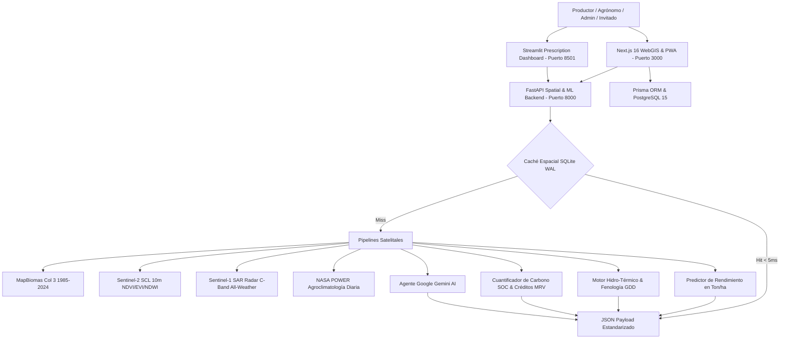

# Agrotech Venezuela 🌾🛰️

**Plataforma Integral de Inteligencia Edafo-Climática, Visión Satelital Multi-Escala (WebGIS 3 Niveles), Radar SAR Sentinel-1 Sin Nubes, Balance Hídrico & Grados Día (GDD), Cuantificación de Créditos de Carbono MRV, Machine Learning Agronómico y Asesoría Gemini AI.**

[](https://opensource.org/licenses/MIT)
[-black.svg)](https://nextjs.org/)
[](https://fastapi.tiangolo.com/)
[](https://streamlit.io/)
[](https://www.python.org/)
[](https://www.postgresql.org/)
[]()

Inspirada y potenciada con las clasificaciones de cobertura y uso del suelo (LULC) de **MapBiomas Venezuela** (1985–2024), **Sentinel-1 SAR Radar**, **Sentinel-2 L2A (Copernicus)** y **NASA POWER**, Agrotech transforma la observación satelital en **decisiones agronómicas precisas, prescriptivas y de acción directa** para productores, agrónomos e investigadores agrícolas.

---

## 🌟 Visión e Innovación Tecnológica

| Dimensión | MapBiomas Venezuela (Observacional) | Agrotech Venezuela (Prescriptivo y Acción) |
| :--- | :--- | :--- |
| **Jerarquía Cartográfica** | Nivel Macro-Nacional. | **WebGIS Multi-Escala de 3 Niveles**: Nacional (24 Estados) ➔ Municipal (335 Municipios / Polos Agrícolas) ➔ Micro-Parcela Sentinel-2 / Sentinel-1 SAR. |
| **Penetración de Nubes** | Obstruido en temporada lluviosa (óptico). | **Radar Sentinel-1 SAR (Banda C - 5.4 GHz)**: Retrodispersión $\gamma^\circ_{\text{VV}}/\gamma^\circ_{\text{VH}}$ para monitoreo de humedad de suelo y anegamiento 100% all-weather. |
| **Modelado Agroclimático** | Climatología general estática. | **Grados Día de Desarrollo ($GDD_{10}^{30}$) & Balance Hídrico ($P - ET_c$)**: Predicción fenológica de fechas de floración y madurez fisiológica. |
| **Certificación de Carbono** | No disponible. | **Calculadora de Créditos de Carbono & MRV**: Cuantificación de SOC (tC/ha), secuestro anual de $\text{tCO}_2\text{e}$ y valoración económica en USD (IPCC Tier 2 / Verra). |
| **Resiliencia Rural & PWA** | Dependencia 100% de internet estable. | **Indicador Visual de Conectividad & Sincronización**, caché geodésico SQLite WAL (< 5ms) y cola de mutaciones offline en IndexedDB. |
| **Modelado de Cosecha** | No disponible. | **Machine Learning Predictivo**: Estimación de rendimiento en **Ton/ha** para 8 cadenas productivas estratégicas. |
| **Prescripción Agronómica** | No prescriptivo. | **Calculadora de Encalado ($CaCO_3$) y Plan Nutricional $N-P-K$** adaptado a insumos venezolanos. |
| **Espacio del Productor** | No disponible. | **Mis Tierras & Cuaderno de Campo Digital**: Registro cronológico de labores, encalados, fertilizaciones y cosechas reales. |
| **Control de Acceso** | Acceso público general. | **Modo Invitado (1-Click Sandbox)**, Registro con aprobación administrativa y **Panel de Control (`/dashboard/admin`)**. |
| **Inteligencia Artificial** | No disponible. | **Agente Google Gemini AI**: Diagnósticos técnicos estructurados y chat agronómico contextual de 40 años. |

---

## 🏗️ Arquitectura del Ecosistema



---

## 🗺️ Módulos Principales del Sistema

### 1. Visor WebGIS Multi-Escala & Radar SAR (`/dashboard/mapa`)
- **Nivel 1 (Nacional)**: Los 24 estados georreferenciados con selector de capas en vivo (**MapBiomas 2024 LULC**, **Semáforo de pH del Suelo**, **Lluvia NASA POWER**, **Radar SAR Sentinel-1**, **Satélite Esri HD**), leyendas dinámicas flotantes y sincronización de redimensionamiento (`map.invalidateSize()`).
- **Nivel 2 (Municipal)**: Transición fluida a polos productivos agrícolas (Turén, Santa Rosalía, Calabozo, Colón, Pedraza, Quíbor, etc.) con polígonos vectoriales GeoJSON, centros de acopio y pH promedio.
- **Nivel 3 (Micro-Parcela)**: Imagen satelital con herramienta vectorial interactiva de delimitación y cálculo esferoidal de hectáreas (**Shoelace geodésico proyectado sobre WGS84**).

### 2. Balance Hídrico & Grados Día de Crecimiento ($GDD_{10}^{30}$)
- Cálculo diario de acumulación térmica ajustado a cultivos tropicales (Maíz, Arroz, Caña de Azúcar, Café, Cacao).
- Predicción cronológica de estadios fenológicos: Emergencia ($V_E$), Diferenciación ($V_6-V_8$), Floración/Antesis ($R_1$), Llenado de Grano ($R_3-R_4$) y Madurez Fisiológica/Cosecha ($R_6$).
- Curva mensual de balance hídrico (Precipitación efectiva vs Evapotranspiración $ET_c$).

### 3. Calculadora de Créditos de Carbono & MRV
- Cuantificación de Stock de Carbono Orgánico en Suelo ($SOC = \text{OM\%} \times 0.58 \times \rho_b \times \text{profundidad}$).
- Evaluación de secuestro anual ($\text{tCO}_2\text{e}/\text{ha}/\text{año}$) bajo Siembra Directa + Coberturas vs Sistemas Agroforestales vs Labranza Convencional.
- Estimación económica en USD de bonos de carbono para el productor agrícola (Metodología IPCC Tier 2 / Verra VCS).

### 4. Indicador de Conectividad & Sincronización en Tiempo Real
- Píldora persistente en cabecera con monitoreo de red (`En Línea 🟢`, `Modo Finca Offline 🟠`, `Sincronizando 🔄`).
- Contador de registros agronómicos pendientes en IndexedDB y botón de sincronización forzada al recuperar señal en campo.

### 5. Espacio del Productor: "Mis Tierras" y "Cuaderno de Campo Digital"
- **Mis Tierras (`/dashboard/tierras`)**: Gestión de parcelas delimitadas, cultivo actual, textura edafológica y acceso a diagnósticos con Gemini AI.
- **Cuaderno de Campo (`/dashboard/bitacora`)**: Registro cronológico de labores (Siembra, Encalado dolomítico, Fertilización NPK/Urea, Riego, Cosecha) y comparación de rendimientos reales (**Ton/ha**).

### 6. Simulador Edafológico & Asesor Gemini AI (`/dashboard/recomendaciones`)
- Sliders reactivos de pH, Materia Orgánica y Textura del Suelo.
- Generación de dictamen agronómico con Gemini AI y exportación de Gemelo Digital en GeoJSON.

### 7. Omnibox (Command Palette) & Navegación Global
- Búsqueda interactiva (Ctrl+K) de estados, municipios y herramientas del sistema.
- Redirección automática y enfoque profundo en el WebGIS usando parámetros de URL (`?state=Zulia`).

### 8. Sistema de Temas & Modo Pleno Sol
- Modos Claro, Oscuro y **Pleno Sol (Alto Contraste)** diseñados para operaciones de campo bajo alta luminosidad, cumpliendo con estándares WCAG AAA.

---

## 🚀 Despliegue y Ejecución Local

### Prerrequisitos
- Node.js 20+ o 22+
- Python 3.13+
- PostgreSQL 15 (o Docker)

### 1. Iniciar Plataforma WebGIS (Next.js 16)
```bash
# Instalar dependencias y generar cliente Prisma
npm install
npx prisma generate

# Iniciar servidor de desarrollo con Turbopack
npm run dev
# Acceder a http://localhost:3000
```

### 2. Iniciar Backend Espacial & ML (FastAPI)
```bash
cd backend
py -m pip install -r requirements.txt
py -m uvicorn src.main:app --port 8000 --reload
# Documentación interactiva en http://localhost:8000/docs
```

### 3. Iniciar Dashboard de Prescripción (Streamlit)
```bash
cd backend
py -m streamlit run streamlit_app.py --server.headless true
# Acceder a http://localhost:8501
```

---

## 🧪 Validación y Pruebas Automatizadas (116 Tests)

Antes de cualquier commit a la rama `main`, se ejecutan y validan ambas suites de testing:

```bash
# 1. Pruebas Unitarias Frontend, WebGIS, SAR Radar, GDD, Map Viewer, Temas, Omnibox & APIs (Jest - 77 tests)
npm test

# 2. Verificación Estática TypeScript
npx tsc --noEmit

# 3. Compilación de Producción (Next.js 16 Turbopack - 25 rutas)
npm run build

# 4. Pruebas Backend Espacial, ML, GEE, Carbono y Caché (Pytest - 39 tests)
cd backend && py -m pytest tests
```

---

## 📜 Licenciamiento y Atribución

- **Código Fuente**: Licencia **MIT** (Copyright © 2026 Frank Sousa - Agrotech Venezuela).
- **Datos de Cobertura y Uso del Suelo**: Referencian y construyen sobre la iniciativa **MapBiomas Venezuela** (Provita, LSIGMA USB, Wataniba y RAISG), disponible bajo licencia **Creative Commons Atribución 4.0 Internacional (CC BY 4.0)**.
