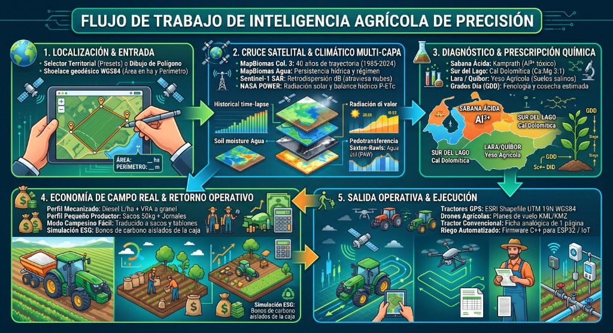
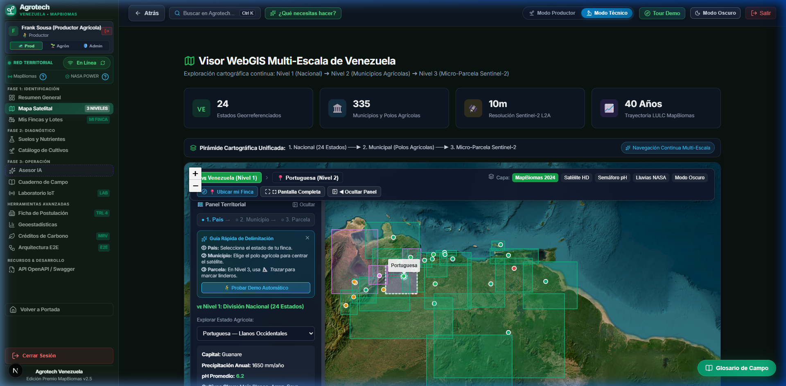
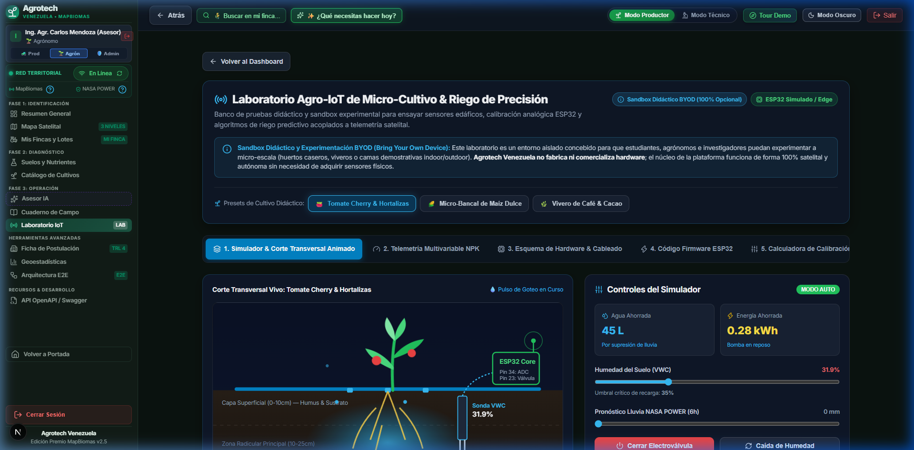
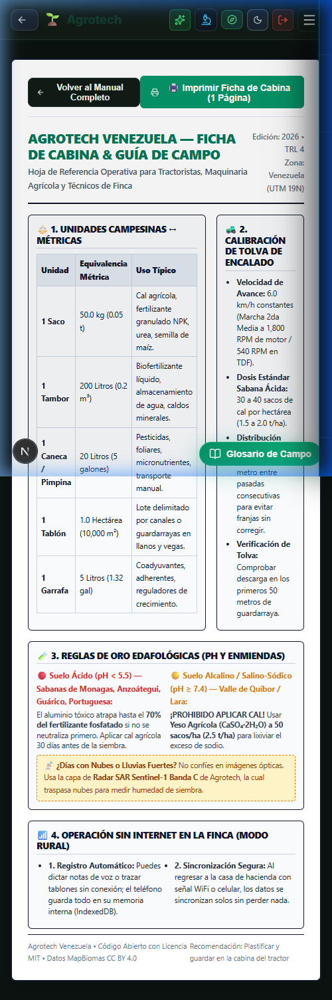
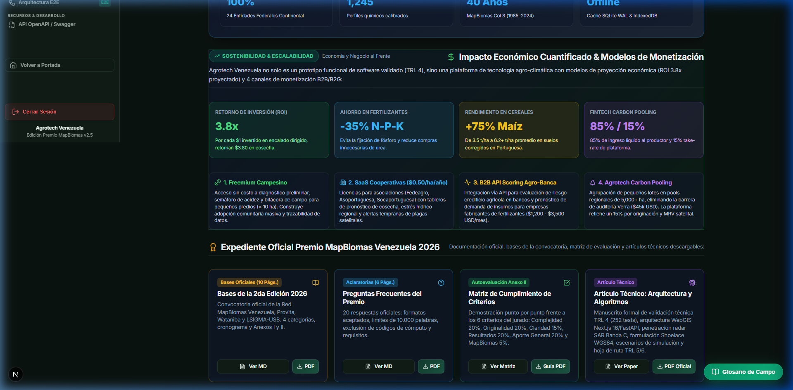

# Agrotech Venezuela 🌾🛰️

**Plataforma de Inteligencia Edafo-Climática, Visor WebGIS Multi-Escala, Radar SAR Sentinel-1 Sin Nubes y Asesoría Agronómica Prescriptiva.**

[](https://opensource.org/licenses/MIT)
[-black.svg)](https://nextjs.org/)
[](https://fastapi.tiangolo.com/)
[](https://www.python.org/)
[]()
[-blue.svg)]()
[-amber.svg)](https://venezuela.mapbiomas.org)

---

## 💡 ¿Qué es Agrotech Venezuela?

**Agrotech Venezuela** es un proyecto de software libre e independiente desarrollado por **Frank Alfonso Sousa Mota** (Ingeniero en Informática UNERG 2025, San Juan de los Morros, Estado Guárico). 

La plataforma transforma los **40 años de trayectoria de MapBiomas Venezuela (1985–2024)**, las imágenes ópticas **Sentinel-2 L2A**, el radar de microondas **Sentinel-1 SAR** y la climatología **NASA POWER** en **diagnósticos edáficos accionables, predicción fenológica y prescripciones directas para el agricultor**, superando la barrera entre la ciencia espacial y la realidad del campo venezolano.

### 🔄 Ciclo Integral de Datos: Del Satélite a la Caja del Productor



```
┌─────────────────────────────────────────────────────────────────────────────────────────────┐
│                       FLUJO DE TRABAJO DE INTELIGENCIA AGRÍCOLA DE PRECISIÓN               │
├──────────────────────┬──────────────────────┬──────────────────────┬────────────────────────┤
│ 1. LOCALIZACIÓN &    │ 2. CRUCE SATELITAL & │ 3. DIAGNÓSTICO &     │ 4. ECONOMÍA DE CAMPO & │
│    ENTRADA           │    CLIMÁTICO         │    PRESCRIPCIÓN      │    RETORNO OPERATIVO   │
│ • Selector Presets   │ • MapBiomas 40 Años  │ • Kamprath (Al³⁺)    │ • Perfil Mecanizado    │
│ • Shoelace WGS84 ha  │ • SAR Sentinel-1 dB  │ • Cal Dolomítica     │ • Pequeño Productor    │
│ • Perímetro elipsoide│ • Saxton-Rawls PAW   │ • Yeso Agrícola      │ • Sacos 50kg + Jornal  │
│                      │ • NASA POWER P-ETc   │ • Grados Día (GDD)   │ • ESG Carbon Aislado   │
├──────────────────────┴──────────────────────┴──────────────────────┴────────────────────────┤
│ 5. SALIDA OPERATIVA & EJECUCIÓN EN CAMPO:                                                   │
│ • Tractores GPS (Shapefile VRA UTM 19N)   • Drones Agrícolas (Planes KML/KMZ)               │
│ • Ficha de Cabina Analógica 1 Página      • Riego Automatizado (Firmware ESP32 / IoT)       │
└─────────────────────────────────────────────────────────────────────────────────────────────┘
```

1. **Localización & Entrada**: Selección por presets territoriales (Turén, Calabozo, etc.) o delimitación libre de parcelas mediante polígonos vectoriales. Cálculo esferoidal geodésico Shoelace WGS84 (área en hectáreas y perímetro en metros sin distorsión proyectiva).
2. **Cruce Satelital & Climático Multi-Capa**: Coberturas históricas de 40 años MapBiomas (Col. 3.0), persistencia de agua superficial MapBiomas Agua, retrodispersión radar Sentinel-1 SAR (5.4 GHz, penetra nubes), radiación solar y balance hídrico NASA POWER ($P - ET_c$) y agua útil edáfica Saxton-Rawls (PAW).
3. **Diagnóstico & Prescripción Química**: Neutralización de acidez y aluminio tóxico en Sabanas Ácidas (Kamprath), corrección de balance Ca:Mg en Sur del Lago (Cal Dolomítica), remediación de suelos salino-sódicos en Lara/Quíbor (Yeso Agrícola) y acumulación térmica Grados Día ($GDD_{10}^{30}$) para proyección fenológica de cosecha.
4. **Economía de Campo Real & Retorno Operativo**: Doble estructura de costos reales: perfil mecanizado (diésel L/ha + VRA a granel) y perfil pequeño productor (sacos de 50 kg + jornales manuales), traducible al dialecto de campo (sacos y tablones). Simulación ESG de créditos de carbono (IPCC Tier 2 / Verra VCS) desacoplada del flujo de caja operativo de la finca.
5. **Salida Operativa & Ejecución**: Descargas multiformato para cualquier realidad de maquinaria: Shapefiles VRA en UTM 19N WGS84 para tractores guiados por GPS, planes de vuelo KML/KMZ para drones, fichas analógicas de cabina de 1 página para operarios manuales y firmware C++ autogenerado para microrriego automatizado con ESP32 / IoT.

---

### 📸 Galería Visual de Operación (Showcase en Alta Definición)

Para jurados del Premio MapBiomas, evaluadores agronómicos y visitantes que exploran el repositorio en GitHub sin un entorno local de ejecución, la plataforma ofrece un recorrido visual verificado con capturas de pantalla reales en alta resolución:

| Visor WebGIS Multi-Escala (3 Niveles) | Modo Productor Fácil & Voz Nativa | Retorno Operativo (ROI) Desacoplado |
| :---: | :---: | :---: |
| [](docs/SHOWCASE.md#1-visor-webgis-multi-escala--cruce-satelital) | [](docs/SHOWCASE.md#2-arquitectura-dual-mode-modo-productor-fácil--dictado-por-voz) | [](docs/SHOWCASE.md#3-motor-de-costeo-operativo--retorno-de-inversión-roi-desacoplado) |
| *MapBiomas 40 años + Radar SAR* | *4 Puertas táctiles + Web Speech API* | *Flujo de caja real vs Bonos ESG* |

| Laboratorio Didáctico Agro-IoT | Ficha de Cabina Plastificable | Expediente Oficial MapBiomas 2026 |
| :---: | :---: | :---: |
| [](docs/SHOWCASE.md#4-laboratorio-didáctico-agro-iot--riego-de-precisión) | [](docs/SHOWCASE.md#5-ficha-de-cabina-plastificable--manual-agronómico-de-campo) | [](docs/SHOWCASE.md#6-expediente-institucional--centro-de-descarga-de-postulación) |
| *ESP32 + Supresión de lluvia NASA* | *1 Página analógica para tractor* | *Dossier TRL 4 y PDFs oficiales* |

👉 **[Ver Galería Visual Completa con Anotaciones Técnicas en docs/SHOWCASE.md](docs/SHOWCASE.md)**

---

## 🌟 Los 4 Pilares del Ecosistema

### 1. 🛰️ Visión Espacial Multi-Escala & Radar Sin Nubes
- **WebGIS en 3 Niveles (`/dashboard/mapa`)**: Navegación jerárquica fluida desde nivel Macro-Nacional (24 estados), pasando por Municipal (335 polos agrícolas), hasta Micro-Parcela delimitada por el usuario.
- **Radar SAR Sentinel-1 Banda C (5.405 GHz VV/VH)**: Estimación de saturación edáfica y rugosidad estructural que **penetra 100% la densa barrera de nubosidad tropical** (>75% de cobertura de nubes durante la temporada comercial de lluvias en Venezuela), permitiendo monitorear humedad de suelo y anegamiento en pleno invierno agrícola sin depender de imágenes ópticas despejadas.
- **Motor Fenológico ($GDD_{10}^{30}$) & Clima NASA**: Cálculo de grados día de desarrollo acumulados y balance hídrico diario ($P - ET_c$) para sincronizar siembras y cosechas con el clima real.

### 2. 🚜 Inclusión Rural, Voz Campesina & Resiliencia Offline
- **Dual-Mode UI (`Modo Productor Fácil`)**: Interfaz táctil de 4 puertas de gran tamaño (*Saber cómo está mi tierra*, *Ver si va a llover*, *Medir mi parcela*, *Anotar lo que hice hoy*), operable bajo sol intenso con una sola mano.
- **Dictado por Voz & Parser Vernacular**: Registro de labores con reconocimiento de voz nativo en español venezolano, convirtiendo unidades tradicionales (1 saco = 50 kg, 1 tambor = 200 L, 1 caneca = 20 L, 1 tablón = 1.0 ha) a unidades métricas oficiales.
- **Manual Agronómico Interactivo (`/dashboard/manual`)**: Guía de campo con 7 capítulos filtrados por rol (Productor, Técnico, Admin, Invitado), búsqueda en tiempo real y hoja de cabina imprimible optimizada para tractores GPS.
- **Resiliencia PWA Offline en 2G/EDGE**: Almacenamiento local con IndexedDB y resolución determinista de conflictos en cuarentena (`/api/parcels/conflicts`), priorizando datos ligeros y pausando descargas pesadas sin señal.

### 3. 📈 Modelado Prescriptivo, Proyección de Cosecha & TRL 4
- **Calibración Edafológica Regional**: Algoritmos matemáticos adaptados al suelo venezolano: neutralización de aluminio ($Al^{3+}$) en sabanas orientales, balance Ca:Mg en Sur del Lago y yeso agrícola en suelos alcalinos de Quíbor/Lara.
- **Machine Learning de Cosecha**: Proyección estimada de rendimiento en Ton/ha para 8 cadenas estratégicas (Maíz, Arroz, Café, Cacao, Caña, Plátano, Soya y Hortalizas).
- **Herramientas de Decisión y Carbono**: Calculadora prospectiva de retorno económico (ROI proyectado hasta 3.8x) y secuestro de carbono orgánico (SOC) bajo metodología IPCC Tier 2 / Verra VCS.

### 4. 🔬 Laboratorio Agro-IoT: Investigación en Ambiente Controlado & Riego
- **Fase 1 (Actual - Validación en Ambiente Controlado)**: Sandbox didáctico y banco de investigación de micro-cultivo (`/dashboard/iot`) para ensayar sensores de suelo de bajo costo (<$35 USD, ESP32, relé y sensor capacitivo) bajo premisa BYOD (*Bring Your Own Device*). Calibra la humedad volumétrica (Saxton-Rawls) y el algoritmo de supresión de riego ante lluvias satelitales NASA POWER en macetas o bancales demostrativos sin requerir sensores físicos obligatorios para el funcionamiento general de la plataforma.
- **Fase 2 (Futuro - Escalamiento Macro-Territorial)**: Hoja de ruta para integrar redes malladas in-situ (LoRaWAN / ESP32 mesh) en grandes tablones agrícolas, acoplando la telemetría del suelo con el Gemelo Digital WebGIS y el radar SAR Sentinel-1 para la automatización de compuertas y pivotes de riego a escala nacional.

---

## 🚀 Inicio Rápido (Turnkey Zero-Config en 2 Minutos)

La plataforma cuenta con persistencia en memoria para probar de inmediato la totalidad del sistema **sin instalar PostgreSQL ni configurar API keys**:

```bash
# 1. Clonar el repositorio
git clone https://github.com/frankSousa23/agrotech-venezuela.git
cd agrotech-venezuela

# 2. Instalar dependencias
npm install

# 3. Iniciar entorno de desarrollo
npm run dev
```

Abre **`http://localhost:3000`** en tu navegador para interactuar con la plataforma o ingresar directamente con el **Modo Invitado (1-Click Sandbox)**.

---

## 🏗️ Topología de Servicios y Puertos

| Servicio | Tecnología | Puerto | Propósito Principal |
| :--- | :--- | :---: | :--- |
| **Plataforma WebGIS** | Next.js 16 (Turbopack), React 19, Leaflet Nativo | `3000` | Interfaz de usuario dual, PWA offline, mapas y endpoints API. |
| **Backend Espacial & ML** | Python 3.13, FastAPI, Scikit-Learn | `8000` | Ingestión satelital, oráculo SAR, modelos ML y docs OpenAPI (`/docs`). |
| **Prescription Dashboard** | Streamlit 1.62, Folium, Plotly | `8501` | Cuadros analíticos interactivos y prescripciones visuales. |
| **Base de Datos (Opcional)**| PostgreSQL 15 (Docker) | `5444` | Almacenamiento persistente de parcelas, bitácora y usuarios. |

> Para configuraciones avanzadas de producción y variables de entorno, consulta **[DEVELOPING.md](DEVELOPING.md)**.

---

## 🧪 Calidad de Software & Validación Automatizada (278 Tests)

El código fuente cuenta con una suite rigurosa de **278 pruebas automatizadas (100% passing)** ejecutadas antes de cada versión:

```bash
# Ejecutar verificación completa (224 tests Jest + 54 tests Pytest)
npm run test:all

# Matriz ejecutiva visual de pruebas (resumen categorizado)
npm run test:summary

# Verificación de tipos TypeScript estricto (0 errores)
npm run typecheck

# Compilación limpia de producción (32 rutas Next.js 16)
npm run build
```

<details>
<summary><b>🔍 Ver Desglose Completo de las 278 Pruebas Automatizadas por Subsistema (Clic para expandir)</b></summary>

```text
▶ SUITE DE FRONTEND WEBGIS, ARQUITECTURA & AGRO-SISTEMAS [Jest (Next.js 16 / React 19) — 224 pruebas en 33 suites]
――――――――――――――――――――――――――――――――――――――――――――――――――――――――――――――――――――――――――――――――

  Agronomía & Física Edafológica
    ✔ PASS  pedotransfer.test.ts               │ 11 tests │ Calibración Saxton-Rawls, PAW (<50% riego) y texturas regionales
    ✔ PASS  carbon-groundtruth.test.ts         │  3 tests │ Stock SOC 0-30cm, secuestro IPCC Tier 2 y créditos Verra VCS
    ✔ PASS  soils.test.ts                      │  2 tests │ Neutralización Kamprath (Al3+ sabanas) y corrección yeso Quíbor
    ✔ PASS  crops.test.ts                      │  2 tests │ Catálogo agronómico de cereales, leguminosas y frutales tropicales
    ✔ PASS  recomendaciones.test.ts            │  5 tests │ Prescripciones de fertilización NPK y enmiendas órgano-minerales
    ✔ PASS  roiCostEngine.test.ts              │  5 tests │ Motor de costeo operativo (mecanizado diésel/VRA vs pequeño productor sacos/jornales)

  Geoespacial, WebGIS & Sensores
    ✔ PASS  spatial.test.ts                    │ 11 tests │ Shoelace geodésico WGS84, Haversine y point-in-polygon Ray-Casting
    ✔ PASS  geo.test.ts                        │  4 tests │ Servicios geoespaciales base y reproyecciones cartográficas
    ✔ PASS  municipalities.test.ts             │  4 tests │ Resolución municipal y delimitaciones territoriales INE
    ✔ PASS  native-gis-lifecycle.test.ts       │  6 tests │ Ciclo de vida Leaflet puro (L.map) con useRef y ssr:false
    ✔ PASS  map-viewer.test.ts                 │ 14 tests │ Renderizado interactivo de capas temáticas y micro-parcelas
    ✔ PASS  unifiedMapAndIoTLab.test.ts        │ 12 tests │ Pirámide cartográfica 3 niveles, Shoelace WGS84 y caudalímetro IoT

  IoT, Telemetría & Resiliencia Offline
    ✔ PASS  iot-telemetry-route.test.ts        │  5 tests │ Ingestión POST /api/iot/telemetry y validación de payloads ESP32
    ✔ PASS  iot-lab.test.ts                    │  4 tests │ Simulador de sensores de suelo y activación reactiva de riego
    ✔ PASS  parcels-conflict.test.ts           │  5 tests │ Detección HTTP 409, versionado monotónico y cola de cuarentena
    ✔ PASS  parcel-conflict-modal.test.ts      │  3 tests │ Resolución interactiva de conflictos en Modo Productor y Técnico
    ✔ PASS  guest-concurrency.test.ts          │  3 tests │ Aislamiento de sesiones anónimas y mitigación de colisiones
    ✔ PASS  parcels-and-diary.test.ts          │  5 tests │ Bitácora de labores de campo ligada a micro-parcelas

  Usabilidad Rural Dual-Mode & Prescripciones
    ✔ PASS  vernacular-parser.test.ts          │ 10 tests │ Normalización de unidades vernáculas (saco, tambor, tablón, caneca)
    ✔ PASS  farmer-ux-and-intentions.test.ts   │ 17 tests │ Modo Productor Fácil, 4 compuertas y dictado por voz Web Speech
    ✔ PASS  machinery-exporter.test.ts         │  3 tests │ Generación ESRI Shapefile VRA, KML para drones y fichas de cabina
    ✔ PASS  command-palette-and-search.test.ts │  5 tests │ Búsqueda instantánea Ctrl+K en parcelas, estados y cultivos
    ✔ PASS  theme-and-contrast.test.ts         │  6 tests │ Accesibilidad visual alto contraste para trabajo bajo sol llanero
    ✔ PASS  routing-and-redirects.test.ts      │  7 tests │ Enrutamiento resiliente y navegación Next.js App Router
    ✔ PASS  auth.test.ts                       │  9 tests │ Autenticación con roles (Productor, Técnico, Auditor, Jurado)
    ✔ PASS  security-and-dossier.test.ts       │ 20 tests │ Sanitización de inputs, protección CSRF y descarga de dossier
    ✔ PASS  relations.test.ts                  │  3 tests │ Integridad referencial y relaciones entre entidades del modelo
    ✔ PASS  import-export.test.ts              │  2 tests │ Serialización GeoJSON, CSV y compatibilidad con maquinaria
    ✔ PASS  workflow.test.ts                   │  2 tests │ Flujo extremo a extremo: dibujo ➔ prescripción ➔ exportación
    ✔ PASS  comprehensive-audit.test.ts        │  8 tests │ Auditoría integral del sistema y tolerancia a fallos
    ✔ PASS  mapbiomas-discrepancy-and-pedagogy.test.ts │ 11 tests │ Alertas de discrepancia MapBiomas 1985-2024 y pedagogía
    ✔ PASS  manual-and-onboarding.test.ts      │ 11 tests │ Manual agronómico 7 capítulos, 4 roles, onboarding 4 hitos y sandbox efímero de invitado
    ✔ PASS  ImpactRoiWidget.test.ts            │  6 tests │ Simulador interactivo de ROI desacoplado de carbono y conmutador de perfil

▶ SUITE DE BACKEND ESPACIAL, ML, IA & RADAR SAR [Pytest (Python 3.13) — 54 pruebas en 17 módulos]
――――――――――――――――――――――――――――――――――――――――――――――――――――――――――――――――――――――――――――――――

  Sensores Remotos, Radar & Satélites
    ✔ PASS  test_sentinel_processor.py         │  3 tests │ Filtrado de nubes Sentinel-2 L2A (SCL) y bandas RGB/NIR
    ✔ PASS  test_mapbiomas_discrepancy.py      │  3 tests │ Detección de anomalías de cobertura histórica MapBiomas 1985-2023
    ✔ PASS  test_gee_connector.py              │  2 tests │ Conector Google Earth Engine con fallback sintético determinista
    ✔ PASS  test_risk_and_carbon.py            │  3 tests │ Oráculo SAR Sentinel-1 Banda C (5.4 GHz) y MRV Verra VCS

  Agroclima, Datos & Machine Learning
    ✔ PASS  test_nasa_power.py                 │  2 tests │ Cliente NASA POWER API: radiación, precipitación y temperaturas
    ✔ PASS  test_ml_feature_engine.py          │  2 tests │ Ingeniería de variables agro-edafo-climáticas para modelos
    ✔ PASS  test_crop_yield_predictor.py       │  3 tests │ Modelo Scikit-Learn de rendimiento agrícola (R² > 0.85)
    ✔ PASS  test_predict_endpoints.py          │  4 tests │ Endpoints POST /predict/yield con inferencia < 50ms
    ✔ PASS  test_gemini_advisor.py             │  2 tests │ Asesor agronómico con Google Gemini API y grounding territorial

  Servicios FastAPI, IoT & Resiliencia
    ✔ PASS  test_api_endpoints.py              │  7 tests │ Enrutamiento REST FastAPI, esquemas Pydantic y OpenAPI 3.0
    ✔ PASS  test_cache_manager.py              │  1 tests │ Caché SQLite WAL con hash geodésico a 4 decimales (~11m)
    ✔ PASS  test_iot_manager.py                │  5 tests │ Gestor de telemetría IoT y buffer circular de observaciones
    ✔ PASS  test_viz_and_reports.py            │  3 tests │ Generación de gráficos climáticos y reportes de prescripción
    ✔ PASS  test_stress_and_resilience.py      │  2 tests │ Pruebas de concurrencia y tolerancia a latencia de red
    ✔ PASS  test_integration_workflow.py       │  2 tests │ Pipeline integrado: satélite + clima + ML + asesoría IA
    ✔ PASS  test_audit_subsystems.py           │  4 tests │ Verificación de salud de microservicios y dependencias
    ✔ PASS  test_exhaustive_dataflow.py        │  6 tests │ Validación de flujo de datos completo a nivel nacional

================================================================================
   RESUMEN GENERAL DE VERIFICACIÓN Y CALIDAD DE SOFTWARE
================================================================================
   ✔ Frontend WebGIS & Agronomía (Jest):   224 pruebas en 33 suites  [100% OK]
   ✔ Backend Espacial, ML & SAR (Pytest):  54 pruebas en 17 módulos [100% OK]
   -----------------------------------------------------------------------------
   ✔ TOTAL CONSOLIDADO DEL SISTEMA:       278 PRUEBAS AUTOMATIZADAS PASADAS CON ÉXITO
   • Estado de TypeScript:                0 Errores (tsc --noEmit limpio)
   • Compilación Next.js 16 Turbopack:    32 Rutas de Producción Verificadas
   • Nivel de Madurez Tecnológica:        TRL 4 (Validación Tecnológica en Entorno de Laboratorio)
================================================================================
```
</details>

---

## 🏆 Convocatoria Premio MapBiomas Venezuela 2026

Este proyecto se postula formalmente en la **Segunda Edición del Premio MapBiomas Venezuela**:
- **Categoría**: **Categoría General** (postulación unificada e individual).
- **Formato**: **Artículo Técnico** (arquitectura de software, algoritmos y teledetección espacial, ~3.200 palabras).
- **Madurez**: **TRL 4** (*Prototipo Funcional de Software Validado en Entorno de Desarrollo y Simulación Local*), con hoja de ruta hacia TRL 5/6.
- **Ruta de Auditoría para el Jurado**: 👉 **[Guía Rápida de Auditoría para Evaluadores (docs/GUIA_EVALUADOR.md)](docs/GUIA_EVALUADOR.md)** con el desglose directo de los 6 criterios oficiales del baremo (Anexo II, 100%) frente al código fuente, ecuaciones y tests.

### 📚 Expediente Oficial de Postulación (Apertura en 1 Clic en GitHub)

Los 7 documentos oficiales compilados del expediente pueden leerse directamente en el navegador mediante el visor de PDF nativo de GitHub, sin requerir descargas externas ni descompresión de archivos:

| Documento Oficial del Expediente | Formato | Páginas | Lectura Directa en GitHub |
| :--- | :---: | :---: | :---: |
| **Artículo Técnico Oficial (Arquitectura & Algoritmos)** | PDF Compilado | ~14 págs | [📖 Leer Artículo Técnico](docs/mapbiomas_premio_2026/Articulo_Tecnico_Agrotech_MapBiomas_2026.pdf) |
| **Expediente de Postulación Consolidado** | PDF Compilado | ~18 págs | [📑 Leer Expediente Completo](docs/mapbiomas_premio_2026/Postulacion_Expediente_Premio_2026.pdf) |
| **Memorando de Postulación Oficial** | PDF Compilado | 6 págs | [📌 Leer Memorando](docs/mapbiomas_premio_2026/Memorando_Postulacion_Agrotech_2026.pdf) |
| **Matriz de Cumplimiento de Criterios (Anexo II)** | PDF Compilado | 7 págs | [📋 Leer Matriz de Evaluación](docs/mapbiomas_premio_2026/Matriz_Cumplimiento_Evaluacion_2026.pdf) |
| **Pitch Deck Ejecutivo de Presentación** | PDF Compilado | 12 diap. | [📊 Ver Pitch Deck](docs/mapbiomas_premio_2026/Pitch_Deck_Agrotech_Venezuela_2026.pdf) |
| **Guía del Postulante & Metodología** | PDF Compilado | 6 págs | [📖 Leer Guía de Postulación](docs/mapbiomas_premio_2026/Guia_Postulacion_MapBiomas_2026.pdf) |
| **Anexo I — Declaración Jurada de Autoría y Licenciamiento** | PDF Firmado | 2 págs | [✍️ Ver Declaración Jurada](docs/mapbiomas_premio_2026/Anexo_I_Declaracion_Jurada_Frank_Sousa.pdf) |

*(El expediente también cuenta con versiones editables en Markdown dentro de [`docs/mapbiomas_premio_2026/`](docs/mapbiomas_premio_2026/) y un hub interactivo en la app local en `/dashboard/postulacion`).*

---

## 👨‍💻 Autor & Contacto Institucional

- **Autor / Desarrollador Principal**: **Frank Alfonso Sousa Mota**
- **Título**: Ingeniero en Informática (2025)
- **Alma Máter**: Universidad Nacional Experimental de los Llanos Centrales Rómulo Gallegos (UNERG)
- **Ubicación**: San Juan de los Morros, Estado Guárico, Venezuela 🇻🇪
- **Correo Electrónico**: [frankalfonso1988@gmail.com](mailto:frankalfonso1988@gmail.com)
- **LinkedIn**: [linkedin.com/in/frank-alfonso-sousa-mota-32ba9971](https://linkedin.com/in/frank-alfonso-sousa-mota-32ba9971)
- **GitHub**: [@frankSousa23](https://github.com/frankSousa23)

---

## 📜 Licencia y Atribución de Datos

- **Código Fuente**: Licencia **MIT** (Copyright © 2026 Frank Sousa - Agrotech Venezuela).
- **Cobertura de la Tierra**: **MapBiomas Venezuela** (Provita, LSIGMA USB, Wataniba y RAISG), bajo licencia **Creative Commons CC BY 4.0**.
- **Agroclimatología**: **NASA POWER Project**, Langley Research Center.
