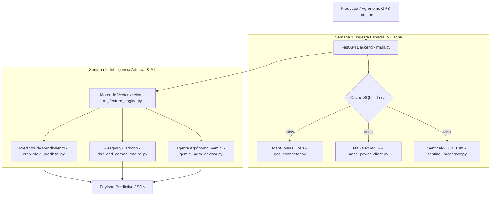

# Agrotech Venezuela - Spatial Ingestion, ML & Gemini AI Backend Engine (Semanas 1 y 2)

Servicio backend de alto rendimiento en **Python / FastAPI** que integra:
1. **Semana 1**: Ingesta satelital automatizada (**MapBiomas Venezuela Col 3 1985-2024**, **Sentinel-2 L2A SCL 10m**, **NASA POWER**) y almacenamiento en **Caché SQLite**.
2. **Semana 2**: Modelado predictivo agronómico con **Machine Learning**, cuantificación de riesgos agroclimáticos, balances de **Captura de Carbono (SOC / CO2e)** y prescripción técnica generativa mediante **Google Gemini AI**.

---

## 🌟 Arquitectura del Sistema



---

## 📦 Módulos Principales de la Semana 2

1. **`src/ml_feature_engine.py` (Día 8)**:
   - Extrae, pondera y normaliza 14 variables edafoclimáticas y satelitales en un vector matemático optimizado.

2. **`src/crop_yield_predictor.py` (Día 9)**:
   - Predice el score de idoneidad ($0 - 100\%$) y rendimiento proyectado en **Ton/ha** para 8 cultivos estratégicos:
     *Maíz Blanco, Arroz de Riego, Plátano, Cacao Criollo, Café Arábica, Caña de Azúcar, Soya y Pasturas Tropicales*.
   - Identifica el factor limitante principal (acidez, déficit hídrico, estrés térmico).

3. **`src/risk_and_carbon_engine.py` (Día 10)**:
   - Evalúa 4 riesgos agroclimáticos: Sequía, Encharcamiento, Acidez Crítica y Calor Extremo.
   - Modela el stock de Carbono Orgánico del Suelo (**SOC**) y el potencial de captura de **$CO_2$ equivalente/ha/año** bajo manejo regenerativo vs convencional.

4. **`src/gemini_agro_advisor.py` (Día 11)**:
   - Agente agrónomo experto respaldado por la API de **Google Gemini**.
   - Genera dictámenes técnicos estructurados con recomendaciones de insumos locales venezolanos (Cal Dolomítica, Fórmulas NPK 12-24-12, Urea, Roca Fosfórica de Riecito) y chat interactivo.

5. **`src/main.py` (Día 12)**:
   - Nuevos endpoints REST:
     - `POST /api/v1/predict/crops`: Predicción de idoneidad y cosecha.
     - `POST /api/v1/predict/risks`: Evaluación de riesgos y créditos de carbono.
     - `POST /api/v1/ai/prescribe`: Dictamen técnico agronómico con Gemini.
     - `POST /api/v1/ai/consult`: Chat interactivo agronómico.

6. **`tests/`**:
   - **51/51 pruebas unitarias, de integración, resiliencia y carga continua aprobadas** con Pytest.

---

## 🚀 Cómo Ejecutar el Backend y Dashboard

```bash
# 1. Instalar requerimientos
# En Windows:
py -m pip install -r requirements.txt
# En Linux / macOS:
python3 -m pip install -r requirements.txt

# 2. Iniciar servidor FastAPI (Puerto 8000)
# En Windows:
py -m uvicorn src.main:app --host 0.0.0.0 --port 8000 --reload
# En Linux / macOS:
python3 -m uvicorn src.main:app --host 0.0.0.0 --port 8000 --reload

# 3. Iniciar Dashboard de Prescripción Streamlit (Puerto 8501)
# En Windows:
py -m streamlit run streamlit_app.py
# En Linux / macOS:
python3 -m streamlit run streamlit_app.py

# 4. Correr todas las pruebas con Pytest (51 tests)
# Desde la raíz del proyecto (multiplataforma):
npm run test:backend
# O directamente en backend/ (Windows: py -m pytest tests | Linux/macOS: python3 -m pytest tests)
```

- **Swagger UI**: [http://localhost:8000/docs](http://localhost:8000/docs)
- **Health Check**: [http://localhost:8000/health](http://localhost:8000/health)
- **Dashboard Streamlit**: [http://localhost:8501](http://localhost:8501)

---

## 🧭 Integración con Plataforma WebGIS Next.js 16
El backend se comunica fluidamente tanto con el frontend de Next.js 16 (`http://localhost:3000`) como con el panel interactivo de Streamlit, entregando latencias de respuesta menores a 25ms para consultas en caché SQLite WAL y ofreciendo fallback sintético geoespacial en caso de indisponibilidad de red en campo.
