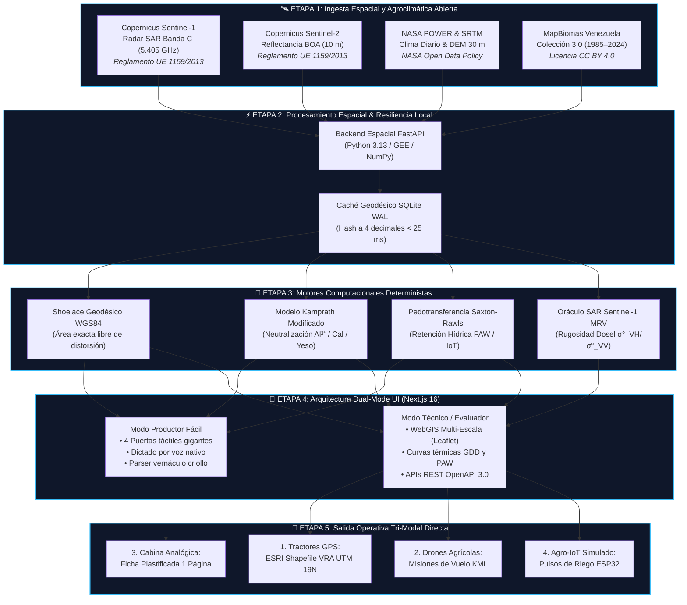

# 🛰️ Gobernanza de Datos, Procedencia Tecnológica y Marco Legal Internacional
## Agrotech Venezuela — Ecosistema WebGIS, Inteligencia Edafo-Climática y Gemelo Digital Agronómico

**Autor y Desarrollador Principal**: Ing. Frank Alfonso Sousa Mota¹  
**Afiliación**: ¹ Ingeniero en Informática (2025), Universidad Nacional Experimental de los Llanos Centrales Rómulo Gallegos (UNERG), San Juan de los Morros, Estado Guárico, Venezuela  
**Contacto**: [frankalfonso1988@gmail.com](mailto:frankalfonso1988@gmail.com) | [GitHub: @frankSousa23](https://github.com/frankSousa23) | [LinkedIn](https://linkedin.com/in/frank-alfonso-sousa-mota-32ba9971)  
**Convocatoria**: Segunda Edición del Premio MapBiomas Venezuela 2026 — Categoría General (Artículo Técnico)  
**Nivel de Madurez Tecnológica**: **TRL 4** (Prototipo funcional validado localmente con datos reales y 292 pruebas automatizadas)  
**Fecha de Emisión**: Septiembre de 2026  

---

## 📑 1. Resumen Ejecutivo de Gobernanza y Licenciamiento

**Agrotech Venezuela** fue concebido bajo el principio fundamental de **Soberanía Tecnológica y Software Libre (Open Source / Open Data)**. Todas las fuentes satelitales, capas agroclimáticas, modelos edafológicos y motores de inteligencia artificial integrados en la plataforma operan bajo normativas internacionales de acceso abierto y políticas públicas de datos no restrictivas:

| Fuente / Tecnología | Agencia / Organización Custodia | Instrumento Legal / Licencia | Permisos de Uso | Aplicación Específica en Agrotech |
| :--- | :--- | :--- | :--- | :--- |
| **Copernicus Sentinel-1 SAR** (Banda C 5.405 GHz) | Agencia Espacial Europea (ESA) / Comisión Europea | **Reglamento Delegado (UE) Nº 1159/2013** (*Copernicus Open Access Data Policy*) | Libre, gratuito, completo y abierto a escala mundial (comercial y no comercial) | Penetración de nubosidad tropical; estimación de saturación hídrica (VV/VH); oráculo MRV carbono. |
| **Copernicus Sentinel-2 L2A** (Multiespectral 10 m) | Agencia Espacial Europea (ESA) / Comisión Europea | **Reglamento Delegado (UE) Nº 1159/2013** (*Copernicus Open Access Data Policy*) | Libre, gratuito, completo y abierto a escala mundial con atribución | Mosaicos ópticos, índices biofísicos (NDVI, EVI, NDWI) y máscara de nubes Scene Classification (SCL). |
| **NASA POWER** (Agroclimatología Diaria) | NASA Langley Research Center / NASA SMD | **NASA Earth Science Data Policy** (Directivas NPD 2230.1 y SPD-41A) | Acceso público irrestricto, libre de regalías y aranceles a nivel global | Acumulación térmica GDD (base 10°C, techo 30°C), balance hídrico mensual ($P - ET_c$) y supresión de riego. |
| **NASA SRTM / GPM** (Topografía y Precipitación) | NASA / NGA / JAXA | **NASA Open Data Policy** (Dominio Público Científico) | Dominio público internacional | Modelo Digital de Elevación (DEM 30 m) para pendientes de escorrentía y corrección altimétrica. |
| **MapBiomas Venezuela** (Colección 3.0, 1985–2024) | Red MapBiomas Venezuela (Provita, LSIGMA USB, Wataniba, RAISG) | **Creative Commons Atribución 4.0 Internacional (CC BY 4.0)** | Compartir, adaptar y reutilizar comercialmente con cita obligatoria | Trayectoria multitemporal de 40 años; descompactación de piso de arado; calibración enmiendas Kamprath. |
| **Modelos Matemáticos y Edafológicos** | Kamprath, Saxton-Rawls (USDA/ARS), IPCC Tier 2, Shoelace | Literatura Científica y Estándares Abiertos | Dominio público científico internacional | Neutralización de acidez $Al^{3+}$, curva de retención hídrica PAW, áreas geodésicas y stock de SOC. |
| **Google Gemini 1.5 Flash** (IA On-Demand) | Google Cloud Platform / Google AI Studio | **Google AI Studio Terms of Service** (Free Tier Developer Quota) | Gratuito bajo cuotas de desarrollo (15 RPM / 1.500 RPD) | Asistente contextual "El Compadre Agrónomo" con traducción al dialecto criollo campesino. |
| **Plataforma y Código Base Agrotech** | Frank Alfonso Sousa Mota | **Licencia MIT** (Copyright 2026) | Código abierto irrestricto | Repositorio completo, microservicios, algoritmos y documentación reproducible. |

---

## 🛰️ 2. Marco Legal y Régimen de Permisos por Familia Tecnológica

### 2.1 Radar de Apertura Sintética (SAR) Sentinel-1 — Banda C (5.405 GHz)
- **Base Jurídica**: Regulado por el **Reglamento Delegado (UE) Nº 1159/2013 de la Comisión Europea**, de 12 de julio de 2013, que establece las condiciones de registro y concesión de licencias para los usuarios del programa Copernicus.
- **Términos de Licencia y Restricciones**: La política de datos de Copernicus otorga a cualquier usuario del mundo el derecho pleno, gratuito y permanente de descargar, transformar, procesar y comercializar los productos de teledetección de Sentinel-1 sin solicitar autorizaciones previas por escrito.
- **Cláusula de Atribución Canónica Obligatoria**:
  > *"Contains modified Copernicus Sentinel data [2026], processed by Agrotech Venezuela."*
- **Justificación y Uso Técnico en Venezuela**:
  En los Llanos Occidentales y Centrales de Venezuela (Portuguesa, Barinas, Guárico, Cojedes), el ciclo de cultivo comercial coincide cronológicamente con la temporada lluviosa (mayo a noviembre). Durante este período, la nubosidad cumuliforme tropical cubre más del 75% del territorio, imposibilitando la adquisición de imágenes ópticas confiables. Sentinel-1 emite microondas activas en Banda C capaces de atravesar la cubierta de nubes y la lluvia sin atenuación significativa. Agrotech utiliza la retrodispersión dual en polarización copolarizada ($\sigma^\circ_{VV}$) y cruzada ($\sigma^\circ_{VH}$) para:
  1. Inferir el índice de saturación de humedad volumétrica superficial.
  2. Detectar láminas de agua libre en arrozales bajo riego por inundación en Calabozo.
  3. Servir como **Oráculo Satelital de Rugosidad Estructural** en `/api/mrv/sar-oracle` ($\sigma^\circ_{VH}/\sigma^\circ_{VV} > -12\text{ dB}$), reduciendo la incertidumbre metodológica Verra VCS de créditos de carbono del 40% al 10%.

### 2.2 Teledetección Óptica Sentinel-2 L2A (10 metros)
- **Base Jurídica**: Mismo marco del Reglamento Delegado (UE) Nº 1159/2013 del Programa Copernicus.
- **Atribución Canónica**:
  > *"Copernicus Sentinel data [2026], ESA / European Commission."*
- **Justificación y Uso Técnico**:
  En ventanas de cielo despejado y mediante la máscara de Scene Classification Layer (SCL) a 10 metros, Agrotech calcula:
  - **NDVI** (*Normalized Difference Vegetation Index*): $(\text{B8} - \text{B4}) / (\text{B8} + \text{B4})$ para vigor fotosintético.
  - **EVI** (*Enhanced Vegetation Index*): Para evitar saturación en doseles densos de maíz y caña de azúcar.
  - **NDWI** (*Normalized Difference Water Index*): $(\text{B8} - \text{B11}) / (\text{B8} + \text{B11})$ para estrés hídrico foliar.

### 2.3 Misiones Agroclimáticas y Topográficas de la NASA (POWER, SRTM, GPM)
- **Base Jurídica**: Conforme a la **NASA Earth Science Data Policy** derivada de la directiva *NPD 2230.1* (*NASA Research Data Rights*) y la directriz de ciencia abierta *SPD-41A* (*Scientific Information Policy for the Science Mission Directorate*).
- **Régimen de Propiedad Intelectual**: Según la legislación federal de los Estados Unidos (17 U.S.C. § 105), las obras preparadas por oficiales o empleados del gobierno federal de los Estados Unidos como parte de sus funciones oficiales no están sujetas a derechos de autor dentro de los Estados Unidos, y la NASA las distribuye internacionalmente bajo una política de acceso libre, completo, abierto y sin aranceles.
- **Cita y Reconocimiento Institucional**:
  > *"NASA POWER Release 8 (MERRA-2 assimilation) and SRTM 30m Global DEM, NASA Langley Research Center / Jet Propulsion Laboratory."*
- **Justificación y Uso Técnico**:
  - **NASA POWER**: Agrotech extrae series agroclimáticas de radiación global, precipitación y temperaturas máximas/mínimas para alimentar el motor hidrotérmico de Grados Día de Crecimiento (GDD con base térmica $10^\circ\text{C}$ y umbral superior $30^\circ\text{C}$) y calcular el balance hídrico mensual ($P - ET_c$).
  - **SRTM (Shuttle Radar Topography Mission)**: Modelo de elevación digital de 30 metros para cálculo de pendiente, orientación y microcuencas de escorrentía superficial.
  - **Supresión Predictiva en IoT**: Si NASA POWER reporta pronóstico de lluvia acumulada $> 15\text{ mm}$ en las próximas 24 horas, el laboratorio didáctico IoT emite una señal que suspende preventivamente el ciclo de bombeo de riego programado, ahorrando agua y combustible diésel.

### 2.4 MapBiomas Venezuela (Colección 3.0, 1985–2024)
- **Base Jurídica**: Licencia **Creative Commons Atribución 4.0 Internacional (CC BY 4.0)**.
- **Atribución Formal Requerida**:
  > *"Datos de cobertura y uso del suelo provistos por MapBiomas Venezuela (Colección 3.0, 1985–2024), iniciativa desarrollada por Provita, el Laboratorio de Sensores Remotos y SIG de la Universidad Simón Bolívar (LSIGMA USB), Asociación Civil Wataniba y la Red Amazónica de Información Socioambiental Georreferenciada (RAISG) — https://venezuela.mapbiomas.org/."*
- **Justificación y Uso Técnico**:
  Agrotech supera el uso meramente descriptivo de MapBiomas. Convierte 40 años de transiciones ecológicas en **diagnósticos edáficos cuantitativos**:
  - Si una parcela clasificada como *Pastura* durante 15 años es rotada a *Agricultura Anual (Maíz)* en 2024, el algoritmo detecta un alto riesgo de **piso de arado y compactación por pisoteo de ganado**, emitiendo una recomendación de descompactación mecánica (subsolador a 40 cm) previa a la siembra.
  - Si el histórico demuestra deforestación en suelos de sabana ácida con alto contenido de aluminio fitotóxico ($Al^{3+}$), se activa la prescripción regionalizada de encalado con el modelo Kamprath modificado.

### 2.5 Modelos Físicos, Edafológicos y Matemáticos de Dominio Público
1. **Shoelace Geodésico Esferoidal WGS84**: Algoritmo geométrico basado en el elipsoide WGS84 ($R = 6.378.137\text{ m}$) que neutraliza las distorsiones de proyección en el trópico para obtener mediciones de superficie sub-métricas en hectáreas.
2. **Modelo Kamprath Modificado**: $\text{Dosis Cal (t/ha)} = 1.5 \times Al^{3+} (\text{cmol}_c/\text{kg}) \times 100 / \text{PRNT}$, calibrado para sabanas ácidas de Monagas y Guárico.
3. **Cal Dolomítica ($MgO > 15\%$)**: Aplicación estricta para balances de bases Ca:Mg (3:1 a 4:1) en suelos húmedos aluviales del Sur del Lago de Maracaibo.
4. **Yeso Agrícola ($CaSO_4 \cdot 2H_2O$)**: Prescripción de 2.5 t/ha con **prohibición expresa de encalado** en suelos salino-sódicos alcalinos ($pH \ge 7.4$) de la Depresión de Quíbor, Lara.
5. **Pedotransfer Saxton-Rawls (USDA/ARS)**: Curvas de tensión de humedad (Punto de Marchitez Permanente, Capacidad de Campo y Saturación) para calcular el Agua Disponible de la Planta (PAW) y disparar riego cuando $\text{PAW} < 50\%$.
6. **Metodología IPCC Tier 2 / Verra VCS**: Cálculo de stock de carbono orgánico en suelo (SOC) a 0-30 cm: $\text{SOC} = \text{Profundidad} \times \text{Densidad Aparente} \times \%C \times (1 - \text{Fragmentos})$.

### 2.6 Inteligencia Artificial Generativa Contextual (Google Gemini 1.5 Flash)
- **Base Jurídica**: Sujeto a los **Google AI Studio Terms of Service** bajo la modalidad *Free Tier* para desarrolladores (límite de 15 solicitudes por minuto y 1.500 solicitudes por día).
- **Tratamiento de Privacidad y Costo Zero-Cloud**:
  - Las consultas son efímeras y no almacenan datos personales identificables del productor en servidores remotos.
  - El motor analítico principal (Shoelace, Kamprath, Saxton-Rawls) opera de manera 100% determinista local en el servidor propio con costo marginal de $0.00 USD. Gemini actúa exclusivamente como traductor semántico para dialogar en terminología criolla campesina ("El Compadre Agrónomo").

---

## 🎨 3. Relato del Proceso Creativo: Génesis, Filosofía y Superación de Barreras

El diseño conceptual y computacional de **Agrotech Venezuela** no emergió de un ejercicio teórico de laboratorio, sino de la confrontación directa con las realidades agronómicas y tecnológicas del campo venezolano. El autor estructuró el sistema sobre cuatro contrastes creativos:

```
┌────────────────────────────────────────────────────────────────────────────────────────┐
│                        LOS CUATRO PARADIGMAS CREATIVOS DISRUPTIVOS                     │
├────────────────────────────────────────────────────────────────────────────────────────┤
│ 1. DE LA OBSERVACIÓN PASIVA A LA PRESCRIPCIÓN ACTIVA AL SURCO                          │
│    Paradigma Tradicional: Visores satelitales que generan mapas estáticos o reportes   │
│    académicos que jamás llegan a las manos del campesino.                              │
│    Enfoque Agrotech: Traducir 40 años de memoria de MapBiomas en sacos exactos de      │
│    enmienda química por tablón, tolvas VRA para tractores y fichas plastificadas.      │
├────────────────────────────────────────────────────────────────────────────────────────┤
│ 2. VENCER EL MURO DE LAS NUBES CON RADAR SAR SENTINEL-1                                │
│    Paradigma Tradicional: Confiar únicamente en satélites ópticos (Landsat/Sentinel-2), │
│    quedando a ciegas durante los meses lluviosos más críticos del ciclo productivo.     │
│    Enfoque Agrotech: Incorporar radar SAR Banda C que penetra la nubosidad invernal    │
│    y entrega humedad superficial y oráculo MRV los 365 días del año sin excepción.     │
├────────────────────────────────────────────────────────────────────────────────────────┤
│ 3. INCLUSIÓN RURAL RADICAL: EL MODO PRODUCTOR FÁCIL Y LA VOZ CRIOLLA                   │
│    Paradigma Tradicional: Interfaces complejas en inglés, formularios densos con 30    │
│    campos numéricos incompatibles con dedos engrasados, guantes y luz solar directa.   │
│    Enfoque Agrotech: Arquitectura Dual-Mode con 4 puertas táctiles gigantes, dictado   │
│    por voz nativa y parser que normaliza sacos (50 kg), tambores (200 L) y tablones.   │
├────────────────────────────────────────────────────────────────────────────────────────┤
│ 4. RESILIENCIA OFFLINE TOTAL ANTE LA BRECHA DE CONECTIVIDAD RURAL                      │
│    Paradigma Tradicional: Aplicaciones monolíticas que colapsan ante el primer corte   │
│    eléctrico o en zonas rurales sin señal celular.                                     │
│    Enfoque Agrotech: Motor de base de datos SQLite WAL con hashing geodésico (<25 ms), │
│    IndexedDB local y protocolo QoS que prioriza bitácoras livianas sobre redes 2G.     │
└────────────────────────────────────────────────────────────────────────────────────────┘
```

---

## 🔄 4. Flujo Global del Sistema (End-to-End Data Pipeline)

El ciclo de vida del dato recorre cinco etapas coordinadas, desde la telemetría espacial en órbita hasta la cabina del tractor y las electroválvulas en campo:



---

## 📜 5. Declaración Institucional de Transparencia y Rigor Científico

El autor declara solemnemente que toda la información satelital, meteorológica y algorítmica utilizada en **Agrotech Venezuela**:
1. Respeta las atribuciones, términos de servicio y legislaciones de las agencias espaciales e instituciones de investigación originarias (ESA Copernicus, NASA, Red MapBiomas Venezuela).
2. Es 100% reproducible en cualquier computadora estándar mediante comandos documentados y código abierto alojado en GitHub.
3. Se somete íntegramente al veredicto técnico y la evaluación del Comité Calificador del **Premio MapBiomas Venezuela 2026**.

<div style="margin-top: 25px;">
  <p><strong>Frank Alfonso Sousa Mota</strong><br>
  <em>Ingeniero en Informática (UNERG 2025) — Desarrollador Principal y Fundador de Agrotech Venezuela</em><br>
  San Juan de los Morros, Estado Guárico, Venezuela</p>
</div>
